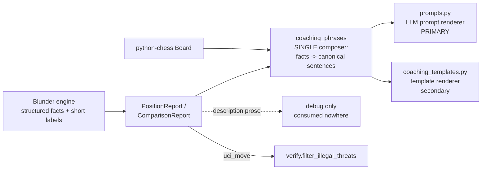

# Design Document

Correct Coaching Inputs for the LLM — a single composition source of
truth feeding the prompt and the template.

## Overview

Introduce `chess_coach/coaching_phrases.py` as the **single source of
truth** that turns a `PositionReport` / `ComparisonReport`'s **structured
fields** into canonical coaching sentences. Route **both** consumers
through it: the LLM prompt builder (`prompts.py`, the primary target) and
the template renderer (`coaching_templates.py`, secondary). Each consumer
only wraps/arranges composed sentences for its medium — neither re-derives
nor re-words facts. The engine `description` prose is demoted to
debug-only and consumed nowhere. `verify.py` reads `threat.uci_move`
instead of parsing prose.

Today the prompt builder is already half here: pawn structure, hanging
pieces, piece-safety (threat map), and top lines are composed from
structured fields; only tactics, threats, and king safety pass engine
prose through. This design finishes the job and unifies all seven
categories behind one composer so the two consumers can never diverge.

The authority boundary is crisp and has no gaps:
- **Engine = facts** (structured, correct, complete enough to compose
  from; short enumerated labels for `theme`/`best_move_idea`/
  `critical_reason`).
- **Client = presentation** (composition, de-duplication, coaching
  relevance, ordering, wording), each a named tested rule.

Where the engine cannot yet supply a fact the client needs (structured
king safety; `uci_move` on all threat types), the fix is a **structured
protocol field on the engine**, never a client prose-parse or a client
re-derivation of engine logic.

## Architecture



Every fact-derived sentence flows through `coaching_phrases`. The two
renderers wrap those sentences (prompt: `--- Section ---` headers;
template: `CoachingSection` objects). `description` is a dead-end.

## Components and Interfaces

### coaching_phrases (the single composer)

`src/chess_coach/coaching_phrases.py` — pure, depends only on `models` +
`python-chess`. One function per fact category, each returning canonical
sentence(s) (never engine prose):

```python
def describe_tactic(t: TacticalMotif, board: chess.Board) -> str: ...
def describe_threat(th: Threat, board: chess.Board) -> str: ...
def describe_king_safety(ks: KingSafety, side: str) -> str | None: ...
def describe_hanging(hp: HangingPiece) -> str: ...
def describe_pawn_structure(pf: PawnFeatures, side: str) -> str | None: ...
def describe_eval(report: PositionReport) -> str: ...
```

The **threat-map** is deliberately NOT a single composed sentence: the
prompt feeds the LLM attacker/defender counts and the UI shows contested /
under-defended tensions. Both read only the structured `threat_map` (never
prose), so they are legitimate per-medium presentations, not a prose
inconsistency. No `describe_piece_safety` is provided.
```

Plus the presentation-policy layer (also pure, tested):

```python
def select_tactics(tactics: list[TacticalMotif]) -> list[TacticalMotif]:
    # motif-identity dedup (prefer on-board over PV), stable order
def suppress_threats_echoing_tactics(threats, shown_tactic_sentences): ...
def king_safety_relevant(report, side) -> bool:
    # coaching-relevance: suppress in low-material endgames (philosophy)
```

Rules:
- Side/piece names derived from `board` + structured squares only.
- Total over the type enums: unknown/malformed input ⇒ safe generic
  sentence, never raises, never empty.
- The on-board vs in-PV distinction is rendered as a clear phrase from
  `in_pv` (e.g. "available now" vs "in the engine's main line").
- Ported for wording from the working C++ in
  `blunder/source/PositionAnalyzer.cpp` (`detect_tactics`, threat and
  king-safety builders) — authored fresh in Python from the structured
  fields, not copied prose.

### Consumers (thin adapters, no fact logic)

- `prompts.py`: `_format_tactics`, `_format_threats`, `_format_king_safety`
  call the composer (Req 3). `_format_pawn_structure`,
  `_format_hanging_pieces`, `_format_threat_map` are migrated to call the
  composer too (Req 1 consistency), replacing their local formatting.
  Each keeps only its `--- Section ---` wrapping and the `in_pv` phrasing
  via the composer.
- `coaching_templates.py`: `_threats_and_tactics_text`,
  `_king_safety_text`, `_hanging_pieces_text`, `_pawn_structure_text`,
  `_board_tensions_text`, `generate_priority_coaching`,
  `generate_move_coaching` (missed tactics) call the composer; the legacy
  `_tactics_text`/`_threats_text` are deleted. Existing dedup /
  threat-echo suppression move into the composer's policy layer.
- `insights.py`: stops copying `t.description`; composes at the render
  boundary.
- `verify.py`: reads `threat.uci_move`; regex helpers deleted.

## Data Models

`KingSafety` gains structured fields (the only client-model change):

```
KingSafety {
  score: int                   # existing, retained
  king_square: str             # new
  castled: bool                # new
  castling_rights: bool        # new
  missing_shield_files: [str]  # new
  open_file_near_king: bool    # new
  description: str             # retained, debug-only, never consumed
}
```

`TacticalMotif` (`type`/`squares`/`pieces`/`in_pv`) and `Threat`
(`type`/`source_square`/`target_squares`/`uci_move`) already carry enough
structure — no client-model change; `Threat.uci_move` must be populated
by the engine for all threat types (Req 4.2).

## Protocol contract changes (engine / Blunder repo)

These are dependencies, tracked here so they are not lost; implemented in
the Blunder repo (its `coaching-protocol` spec):

1. Add the structured king-safety fields above to the `coach eval` JSON
   (+ Blunder tests).
2. (No change needed.) Move-bearing threats (check, capture) already set
   `uci_move`; fork/pin/skewer threats are relational (no move) and
   correctly omit it, so the filter keeps them.
3. Document `description` as debug/non-authoritative; no version break.

Deliberately NOT changed on the engine: the king-safety `score`
component (it also feeds eval); coaching-relevance of that score in
endgames is a **client** policy (`king_safety_relevant`), per the
coaching-philosophy relevance tiers — a first-class rule, not a
workaround.

## Relationship to the engine-as-verifier strategy

The BACKLOG "engine as verifier" item spans two distinct things; this
spec owns one and explicitly excludes the other.

**In scope — the rules-tier verifier on the ENGINE's own facts.**
`verify.filter_illegal_threats` (shipped) drops engine-supplied threats
whose move is illegal for the owning side. This spec:
- Keeps that legality verification (belt-and-suspenders, even as the
  Blunder detector becomes legality-aware).
- Changes only HOW it reads the move — from `threat.uci_move`, not a
  regex over prose (Req 4).
- Requires the composer to run on the **post-verified** report: the
  filter runs first (in `CoachingEngine.get_position_report`), the
  composer phrases only facts that survived it. Composed sentences are
  therefore ground-truth by construction (derived from structured,
  legality-checked facts), which is the input-side half of "the engine
  as verifier."

**Out of scope — verifying the LLM's OUTPUT.** The offline
**prompt-ablation** spend and the online **write → machine-check →
repair** loop verify the prose the model *generates* (relational claims,
piece-type misID, possession errors) against the engine. That is a
separate concern and a separate future effort (the consolidated BACKLOG
item). This spec makes the *inputs* correct and consistent, which is the
precondition and complement to that loop — correct inputs shrink what a
repair loop must catch, but do not replace it. No output-verification
work is added here.

## Correctness Properties

### Property 1: Composer totality

`describe_*` never raise and never return empty/`""` for a present fact
over the full type enums; unknown types yield a safe generic sentence.

**Validates: Requirements 1.1, 1.4**

### Property 2: Determinism

Identical structured input (report + FEN) ⇒ identical composed output.

**Validates: Requirements 1.4, 9.2**

### Property 3: No prose dependency

Composed output is a function of structured fields + board only; setting
every engine `description` to a sentinel never changes composer output
and never surfaces the sentinel.

**Validates: Requirements 2.1, 2.2**

### Property 4: Consumer parity

For any report, the sentence the prompt path shows for a given fact
equals the sentence the template path shows (both are the composer's
output); consumers differ only in wrapping.

**Validates: Requirements 1.2, 1.3, 3.3**

### Property 5: Policy invariance

Motif dedup + threat-echo suppression collapse the same set regardless of
input ordering (keys are structured motif identity, not text).

**Validates: Requirements 6.2**

## Error Handling

- Unknown tactic/threat `type` ⇒ generic fallback sentence, debug log;
  never raises, never empty (Req 1.4).
- Malformed `squares` (too few entries) ⇒ type-only sentence rather than
  indexing past the end.
- Missing `threat.uci_move` ⇒ move-less sentence; recorded as an engine
  gap (Req 4.3), never recovered by prose parsing.
- Bad FEN ⇒ composer returns type-only sentences; FEN parsing is guarded
  at the call boundary as today.

## Testing strategy

- **Sentinel test (Req 2.2, the DoD gate):** report with every
  `description` = `"__ENGINE_PROSE__"`; assert absent from all built
  prompts and all template output.
- **Parity test (Req 9.3):** assert the prompt renderer and template
  renderer emit the same composer sentence for the same fact.
- **Property tests (≥100):** totality, determinism, policy invariance.
- **Unit tests:** pin representative composed sentences per tactic/threat
  type and king-safety case against the C++ reference wording
  (side-labelled, no "in PV" token, on-board/in-PV phrased clearly).
- **verify tests:** illegal-threat filtering from `uci_move` with
  `description` absent.
- Existing dedup / threat-echo tests re-pointed at the composer policy
  layer.

## Migration and sequencing

- The current uncommitted chess-coach work (tactic dedup, threat-echo
  suppression, `show_template_coaching.py`) folds INTO the composer's
  policy layer — carried forward, not discarded.
- The uncommitted Blunder wording WIP (side labels, "in PV" removal) is
  reverted (Req 8.2); the engine keeps only structural changes.
- Build the composer first (fully testable, no engine), migrate the
  prompt path (primary), then the template, then unify the four
  already-composed sections, then close the engine contract items, then
  the DoD gate.
