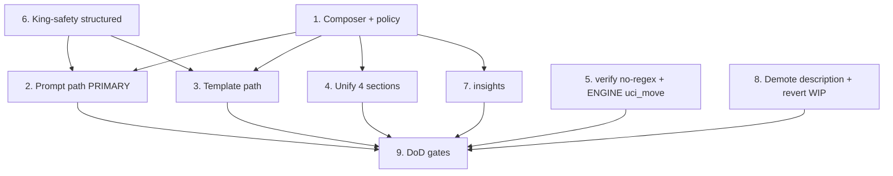

# Implementation Plan

## Overview

Build the single composer first (pure, fully testable, no engine), then
migrate the **LLM prompt path** (the priority), then the template, then
unify the four already-composed sections so the two consumers share one
source, then close the engine protocol-contract items, then prove
completeness with the sentinel + parity gates. Nothing is "done" until
Task 9 passes — that gate is the guarantee against a half-migration.

Conventions: Python 3.11, `src/` layout, `uv run pytest` / `uv run mypy
src` (strict) / `uv run ruff check src tests` + `ruff format --check`.
Offline/local, no new runtime deps. Wording ported (not copied) from
`blunder/source/PositionAnalyzer.cpp`. Engine tasks (marked ENGINE) land
in the Blunder repo.

## Tasks

- [x] 1. The single composer module + policy layer
  - [x] 1.1 Create `src/chess_coach/coaching_phrases.py` with
        `describe_tactic`, `describe_threat`, `describe_hanging`,
        `describe_pawn_structure`, `describe_piece_safety`,
        `describe_eval`. Pure; side/piece names from board + structured
        squares; total over type enums (safe generic fallback, never
        raise/empty). On-board vs in-PV rendered as a clear phrase from
        `in_pv`. (`describe_king_safety` is deferred to Task 6.3 — it
        needs the structured king-safety fields that do not exist yet;
        building it now would force reading the prose `description`.)
  - [x] 1.2 Add the pure policy layer: `select_tactics` (motif-identity
        dedup, prefer on-board, stable order), threat-echo suppression,
        `king_safety_relevant` (endgame relevance per coaching-philosophy).
  - [x] 1.3 Property tests (Hypothesis ≥100): Property 1 totality,
        Property 2 determinism, Property 5 policy invariance. Unit tests:
        representative sentence per tactic/threat type + king-safety
        cases vs the C++ reference wording.
  - _Requirements: 1.1, 1.4, 6.2, 9.2_

- [x] 2. Migrate the LLM prompt path (PRIMARY)
  - [x] 2.1 `prompts._format_tactics` (rich + move-eval) + `_format_missed_tactics`:
        render via `describe_tactic` + `select_tactics`; on-board/in-PV
        phrase from the flag; stop reading `tactic.description`.
  - [x] 2.2 `prompts._format_threats`: render via `describe_threat` +
        threat-echo suppression; stop reading `threat.description`.
  - [x] 2.3 `prompts._format_king_safety`: render via
        `describe_king_safety` gated by `king_safety_relevant` (now
        returns None ⇒ both call sites append conditionally); stop reading
        `ks.description`.
  - _Requirements: 3.1, 3.2, 3.3, 2.1_

- [x] 3. Migrate the template path
  - [x] 3.1 Routed `_threats_and_tactics_text`, `_king_safety_text`,
        `generate_priority_coaching`, `generate_move_coaching` (missed
        tactics) through the composer + policy layer; deleted the local
        dedup (`_tactic_dedup_key`) and threat-echo copies.
        `_king_safety_text` dropped its unused `level` param.
  - [x] 3.2 Deleted legacy `_tactics_text` / `_threats_text` and the
        template-local `_piece_name_at` (only used by `_threats_text`).
  - [x] 3.3 Re-pointed `test_coaching_arrows.py` dedup / label / threat
        tests at composed output.
  - _Requirements: 1.2, 1.3, 2.1, 6.2_

- [x] 4. Unify the prose-sentence sections (consistency)
  - [x] 4.1 Routed pawn-structure and hanging-pieces through the composer
        (`describe_pawn_structure` / `describe_hanging`) in BOTH
        `prompts.py` and `coaching_templates.py`, keeping only medium
        wrapping (section header vs "Piece safety:" / strategy prefix).
  - [x] 4.2 Routed the eval assessment through `describe_eval` for the
        template (`_eval_summary` now delegates; identical logic dedup).
  - [x] 4.3 SCOPING DECISION: the threat-map / piece-safety section stays
        medium-specific and is NOT a single composed sentence — the prompt
        feeds the LLM attacker/defender counts, the UI shows contested /
        under-defended tensions; both read only the structured
        `threat_map` (never prose), so this is a legitimate presentation
        difference, not a prose inconsistency. Removed the unused
        `describe_piece_safety` rather than force a poor fit.
  - _Requirements: 1.1, 1.2, 1.3_

- [x] 5. Remove regex; structured threat move (verify + ENGINE)
  - [x] 5.1 Confirm `uci_move` coverage (done — no engine change): check
        and capture threats set `uci_move`; fork/pin/skewer threats are
        relational facts (an already-placed piece, no move) and correctly
        omit it, so the filter keeps them. `detect_threats` emits no
        discovered-attack threat type. The spec's earlier "populate
        uci_move on all threat types" was over-broad and is corrected.
  - [x] 5.2 Rewrite `verify.filter_illegal_threats` to read
        `threat.uci_move`; delete `_VIA_RE` / `_UCI_RE`. Composer degrades
        to a move-less sentence if `uci_move` absent. Keep the legality
        filter running BEFORE composition (it stays as belt-and-suspenders;
        the composer phrases only post-verified facts).
  - [x] 5.3 Update `test_verify.py`: filtering works from `uci_move` with
        `description` absent/sentinel.
  - _Requirements: 4.1, 4.2, 4.3_

- [x] 6. King-safety structured fields (ENGINE + client)
  - [x] 6.1 ENGINE: added `king_square`, `castling_status` (enum:
        kingside_castled / queenside_castled / uncastled_with_rights /
        stuck_in_center / displaced), `missing_shield_files`,
        `open_file_near_king`, `pawn_storm` to the `KingSafety` struct +
        `coach eval` JSON (CoachJson quotes file letters); Blunder test
        added (`king safety exposes structured fields`), full suite green.
        (Used a `castling_status` enum instead of the two bools
        `castled`/`castling_rights` — it preserves the stuck-in-center vs
        displaced distinction the prose had.)
  - [x] 6.2 Extend `models.KingSafety` (+ `from_dict` / `to_dict`) with
        those fields, backward-compatible defaults; `description` retained,
        debug-only.
  - [x] 6.3 Implement `describe_king_safety` from the structured fields;
        `king_safety_relevant` endgame suppression lives in the composer
        policy layer (callers gate with it). Unit tests.
  - _Requirements: 5.1, 5.2, 5.3_

- [x] 7. insights.py
  - [x] 7.1 `extract_threats` composes `ThreatInfo.description` via
        `describe_threat` (structured fields) instead of copying
        `t.description`; downstream "Resolved:" / "Still watch out for:"
        now render composed sentences.
  - _Requirements: 2.1_

- [x] 8. Demote engine description (docs)
  - [x] 8.1 Documented `description` fields (Threat / TacticalMotif /
        KingSafety) as engine debug output, non-authoritative, never
        consumed by the client — in `models.py`. No protocol version break.
  - [x] 8.2 DECISION — do NOT revert the engine wording WIP. Rationale:
        the side-label + "in-PV"-removal edits make the debug `description`
        accurate, are already partly committed (`491ec6c`) and covered by a
        Blunder test, and `description` is now debug-only so its wording is
        harmless. Reverting would be risky git surgery on changes
        interleaved with the king-safety work (and would break that test)
        for zero product benefit. The engine keeps its structural /
        legality / `uci_move` / king-safety-field changes AND the improved
        debug wording.
  - _Requirements: 7.1, 7.2, 8.1_

- [x] 10. Extend the single source to the eval judge (scope extension)
  - [x] 10.1 The judge's own `eval/judge.py::format_engine_report` (used by
        `build_judge_prompt`, `build_pairwise_prompt`, and the move-feedback
        pairwise prompt) previously read `t.description` for threats and
        tactics. Migrated it onto the composer (`describe_threat` /
        `describe_tactic` / `describe_hanging`) with the same
        `select_tactics` + `suppress_threats_echoing_tactics` policy the
        coach uses — so the Layer-2 judge grounds on exactly what the coach
        saw. King safety is not part of the judge report (unchanged).
  - [x] 10.2 Extended the sentinel test (Task 9.1) to cover
        `build_judge_prompt` and `build_pairwise_prompt`; judge test suites
        (`test_eval_judge`, `test_pedagogy_judge`) stay green.
  - _Requirements: 2.1, 6.2_

- [ ] 9. Definition-of-done gates
  - [x] 9.1 Sentinel test (Property 3 / Req 2.2): `tests/test_no_prose_leak.py`
        sets every `description` = `"__ENGINE_PROSE__"` and asserts it is
        absent from every prompt (rich/socratic/move-eval), template
        (flat/structured/move), insights output, AND both judge prompts
        (single + pairwise). Passes.
  - [x] 9.2 Parity test (Property 4 / Req 9.3): asserts the prompt and
        template render the same composer sentence for the same tactic.
  - [x] 9.3 Full green: `uv run pytest` (548), `uv run mypy src` (38
        files), `uv run ruff check src tests`, `uv run ruff format
        --check` — all clean. Updated BACKLOG (shipped note) and BUGS
        (BUG-009: king-safety now via shared `king_safety_relevant` +
        structured fields).
  - _Requirements: 2.2, 9.1, 9.3, 9.4_

## Task Dependency Graph



- Task 1 is the foundation for all client consumers.
- Task 6 (king-safety structured fields) gates the king-safety parts of
  Tasks 2 and 3; sequence 6 before finalizing those.
- Task 5 (regex removal) is independent; do early.
- Tasks 5, 6, 8 carry ENGINE subtasks in the Blunder repo.
- Task 9 is the hard completeness gate.
```json
{ "waves": [
  { "wave": 1, "tasks": ["1", "5"] },
  { "wave": 2, "tasks": ["6"] },
  { "wave": 3, "tasks": ["2", "3", "4", "7"] },
  { "wave": 4, "tasks": ["8", "9"] }
] }
```

## Notes

- The current uncommitted chess-coach dedup / threat-echo / label work
  folds into Task 1's policy layer — carried forward, not discarded.
- `theme`, `best_move_idea`, `critical_reason`, `threat_map_summary`
  stay engine-owned labels / unused (Req 7) — out of scope unless found
  to be full sentences.
- This spec spans both repos by design; ENGINE subtasks are the
  structured protocol changes that let the client compose without any
  workaround.
