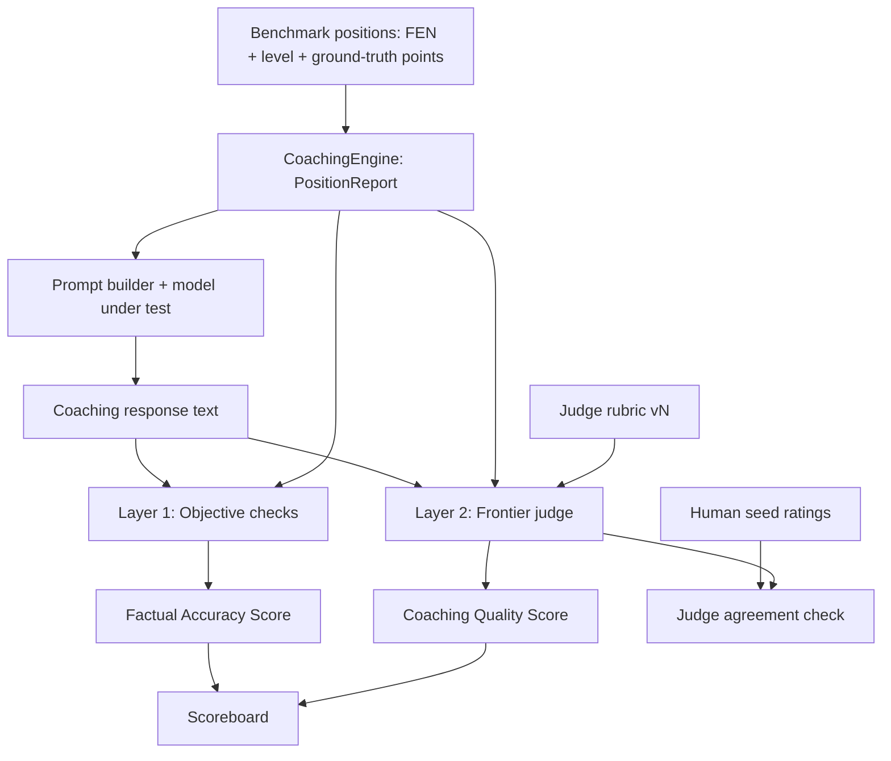

# Design Document: Coaching Evaluation Harness

## Overview

A three-layer evaluation harness that measures chess-coach output along
two axes:

- **Factual accuracy** — is what the coach said *true*? Measured
  objectively by checking the response against the engine's structured
  report (the oracle). No model judgment, no cost.
- **Coaching quality** — is it *good teaching*? Measured by a frontier
  LLM judge applying a fixed rubric, grounded in the engine report so
  the judge never refereed chess from its own fallible vision. Anchored
  to a human-rated seed set.

The design's central bet: chess-coach is unusually lucky for an
open-ended-generation eval because it has an oracle. Most LLM eval
can't verify facts and must lean entirely on judges/humans. Here, a
large fraction of "does the model know chess" is objectively checkable
against the engine. So we push everything we can into Layer 1 (free,
deterministic) and reserve the judge for the genuinely subjective part.



## Architecture

The harness is a new package under `scripts/eval/` (promoted from the
single-file `eval_coaching.py`) plus a small library module the scripts
share. Library code that other parts of the app might reuse
(checkers, data models) lives in `src/chess_coach/eval/`; the runnable
entry points stay in `scripts/`.

```
src/chess_coach/eval/
    __init__.py
    benchmark.py      # BenchmarkPosition model + loader (reads data/eval/*.yaml)
    objective.py      # Layer 1 checks (extends probe checkers)
    judge.py          # Layer 2: rubric, judge prompt builder, verdict parser
    scoring.py        # aggregation → FactualAccuracyScore, CoachingQualityScore, Scoreboard
data/eval/
    positions.yaml    # the annotated benchmark set (grows without code change)
    rubric.v1.yaml    # the versioned judge rubric
scripts/
    eval_run.py       # orchestrator: run models × positions, Layer 1 [+ Layer 2]
    eval_calibrate.py # generate seed-set artifact, ingest human ratings, report agreement
```

### Run flow

1. Load `BenchmarkPosition`s from `data/eval/positions.yaml`.
2. Start `CoachingEngine`; for each position get the `PositionReport`.
3. For each model under test: build the rich prompt, generate the
   coaching response.
4. **Layer 1** runs always: objective checks against the report/board →
   `FactualAccuracyScore`.
5. **Layer 2** runs when `--judge <endpoint>` is passed: build the
   judge prompt (response + report + rubric), call the frontier judge,
   parse the structured verdict → `CoachingQualityScore`.
6. Aggregate into a `Scoreboard`; persist full results + run config.

## Layer 1 — Objective checks (`objective.py`)

Deterministic, engine-grounded. Each check takes the response text and
the `PositionReport` (or board) and returns structured findings.

| Check | Source of truth | Output |
|---|---|---|
| Piece hallucination | board state (FEN) | list of false "piece on square" claims |
| Illegal move | legal moves | list of illegal SAN/UCI mentions |
| Eval direction | `report.eval_cp` sign | bool: response's stated advantage matches sign |
| Key-fact coverage | `report` ground-truth points | fraction of checkable points mentioned |

The first two are lifted from `probe_llm_chess.py` (extended, not
duplicated — moved into `objective.py`, the probe imports them back).
Eval-direction and coverage are new but small.

**Key-fact coverage** is the interesting one. A `BenchmarkPosition`'s
ground-truth points are structured (`hanging_piece: e4`,
`eval_direction: white_better`). Coverage asks: does the response
*reference* the checkable fact? For a hanging piece on e4, "your knight
on e4 is undefended" hits; silence misses. This is still a
text-presence check, but against *position-specific ground truth* the
engine confirmed — not a generic keyword. That's the difference from
today's `expect_keywords`.

`FactualAccuracyScore` = weighted combination: hard penalties for
hallucinations and illegal moves (a single hallucination should tank
the score — the whole point is trust), softer credit for coverage and
eval direction.

## Layer 2 — Frontier judge (`judge.py`)

This is the part you care about, so it gets the detail.

### The judge contract

The judge is **not** asked "is this good chess coaching" in a vacuum.
It is handed the engine's ground truth and asked to grade the coaching
*against that*. This is what keeps even a frontier model honest: it
isn't refereeing two fallible chess players from its own board vision,
it's checking text against an oracle.

Judge prompt anatomy:

```
[System]
You are evaluating a chess coaching response. You are given the
engine's authoritative analysis of the position. Treat the engine
analysis as ground truth. Do NOT use your own chess analysis to
judge factual claims — only the engine data provided. Your job is to
score the coaching text against the rubric and flag any claim in it
that contradicts the engine data.

[Position]
FEN, side to move, skill level the coaching targets.

[Engine ground truth]
--- Eval Breakdown ---   (overall cp, material, mobility, king safety, ...)
--- Hanging Pieces ---
--- Threats / Tactics ---
--- Top Engine Lines ---
(empty sections omitted, same formatting as the coaching prompt)

[Coaching response to grade]
<the model-under-test's output>

[Rubric]
For each criterion, answer yes/no and give a one-clause reason.
Then list any factual contradictions with the engine data.
Return JSON: { criteria: {key: {pass: bool, reason: str}, ...},
               contradictions: [str], notes: str }
```

### The rubric (`data/eval/rubric.v1.yaml`)

Binary/anchored criteria, not a vibes-based 1–10. Each is a yes/no the
judge can defend with one clause:

| Key | Criterion |
|---|---|
| `key_idea` | Names at least one genuinely important feature of the position (matches what the engine data emphasizes). |
| `explains_why` | Explains *why* that feature matters (cause/consequence), not just that it exists. |
| `actionable` | Gives a concrete plan or move idea the student can act on. |
| `level_fit` | Matches the target level; for beginner, avoids engine jargon (centipawns, PV, depth) and notation beyond basic piece/square names. |
| `grounded` | Makes no claim that contradicts the engine data (this criterion fails if `contradictions` is non-empty). |
| `constructive` | Acknowledges good aspects before problems, when applicable; teaching tone, not a verdict. |

`CoachingQualityScore` = fraction of criteria passed (optionally
weighted: `grounded` and `key_idea` weighted higher — a fluent answer
that's wrong or off-topic should score low even if tone and
actionability pass).

The rubric is data, versioned. Changing a criterion bumps the version
(`rubric.v2.yaml`), and the version is stamped on every result so old
and new scores are never silently compared.

### Scoring mode: per-criterion vs pairwise

Two supported modes:

- **Absolute** (default): each response judged independently against
  the rubric → per-criterion pass/fail. Good for tracking one model
  over time and for the scoreboard.
- **Pairwise** (optional): same position, two models' responses, judge
  picks the better one. More reliable for "is model A better than B"
  questions because relative judgments are more stable than absolute
  scores. When used, presentation order is randomized per comparison to
  cancel position bias, and we record which slot each model occupied.

### Bias mitigations

Known LLM-judge failure modes and how we handle them:

- **Length bias** (judges prefer longer answers): the rubric is
  feature-based, not length-based, and word count is reported
  separately so a length/score correlation is visible.
- **Position bias** (pairwise): randomized order, recorded.
- **Self-preference** (judge prefers its own family's style): the judge
  is a *different, stronger* model than those under test (frontier vs
  local 8B), and the rubric is concrete enough that style preference
  has little room. Documented as a known caveat.
- **Determinism**: judge runs at temperature 0; rubric + judge model +
  versions recorded.

### Endpoint pluggability

The judge is reached through the existing `LLMProvider` abstraction.
`OpenAICompatProvider` already speaks the OpenAI schema, so the judge
endpoint is just a `(base_url, model, api_key)` config. Three concrete
options, all the same code path:

1. **Direct frontier API** — Anthropic / Bedrock / OpenAI key.
2. **FITT gateway** — `base_url` → the gateway, `model` →
   `fitt-smart` (routes to Claude). Reuses existing infra and gets cost
   logging for free.
3. **kiro-cli / MCP bridge** — any process exposing an
   OpenAI-compatible shim.

The harness doesn't care which; it records the resolved judge model id
in results.

## Layer 3 — Human calibration (`eval_calibrate.py`)

1. **Generate seed artifact**: run the benchmark (Layer 1 + generate
   responses) for a seed subset, emit a markdown file with, per
   response: the board, the engine report, the coaching text, and a
   blank rubric checklist. This is the `probe_llm_chess.py` review
   format, extended with the rubric checklist.
2. **Ingest human ratings**: the human fills the checklist (a YAML
   sidecar `data/eval/seed_ratings.yaml` keyed by position+model).
3. **Agreement report**: run the judge on the same seed responses and
   compute `Judge_Agreement` — per-criterion percent agreement and
   overall correlation between judge pass-rate and human pass-rate.
4. If agreement is below threshold (documented default: 80%
   per-criterion agreement), the report flags it: revise the rubric
   wording or pick a stronger judge before trusting automated scores.

Calibration is a one-time (occasional) activity, not part of every run.
Once the judge agrees with the human on the seed set, Layer 2 is
trusted for unreviewed positions.

## Data Models

```python
@dataclass(frozen=True)
class GroundTruthPoint:
    kind: str            # "hanging_piece" | "eval_direction" | "tactic" | "phase" | "free"
    value: str           # "e4" | "white_better" | "fork" | "endgame" | <text>
    required: bool = True

@dataclass(frozen=True)
class BenchmarkPosition:
    id: str
    fen: str
    level: str           # beginner | intermediate | advanced
    phase: str           # opening | middlegame | endgame
    points: list[GroundTruthPoint]
    notes: str = ""

@dataclass
class ObjectiveResult:
    hallucinations: list[str]
    illegal_moves: list[str]
    eval_direction_ok: bool
    coverage_hits: list[str]
    coverage_total: int
    factual_score: float          # 0-1

@dataclass
class JudgeVerdict:
    criteria: dict[str, tuple[bool, str]]   # key -> (pass, reason)
    contradictions: list[str]
    quality_score: float          # 0-1
    judge_model: str
    rubric_version: str

@dataclass
class ResponseEval:
    position_id: str
    model: str
    response: str
    word_count: int
    latency_s: float
    objective: ObjectiveResult
    judge: JudgeVerdict | None    # None when Layer 2 not run
```

Existing models (`PositionReport`, `ComparisonReport`,
`CoachingSection`) are reused unchanged.

## Correctness Properties

### Property 1: Hallucination tanks factual score
*For any* response containing a confirmed piece-placement hallucination,
`ObjectiveResult.factual_score` SHALL be strictly less than the score
the same response would receive with the hallucination removed, and a
single hallucination SHALL cap the factual score below the "pass"
threshold.
**Validates: Requirements 2.1, 2.5**

### Property 2: Objective layer needs no judge
*For any* benchmark position and response, computing `ObjectiveResult`
SHALL succeed with no LLM provider configured.
**Validates: Requirements 2.6, 6.5**

### Property 3: Judge is grounded
*For any* judge invocation, the judge prompt SHALL contain the engine
report sections for the position and the instruction to treat them as
ground truth and not use independent chess analysis.
**Validates: Requirements 3.1, 3.2, 3.3**

### Property 4: Verdict is structured and deterministic in shape
*For any* judge response, the parser SHALL produce a `JudgeVerdict` with
a pass/fail and reason for every rubric criterion, or raise a clear
parse error; and the harness SHALL record `judge_model` and
`rubric_version`.
**Validates: Requirements 3.4, 3.6, 4.4**

### Property 5: Grounded criterion ties to contradictions
*For any* `JudgeVerdict`, the `grounded` criterion SHALL fail if and
only if `contradictions` is non-empty.
**Validates: Requirements 3.2, 4.2**

### Property 6: Pairwise order randomization is recorded
*For any* pairwise comparison, the harness SHALL randomize which model's
response appears first and SHALL record the assignment so results are
auditable.
**Validates: Requirement 3.8**

### Property 7: Run is fully recorded
*For any* completed run, the persisted results SHALL include the model
list, judge model (if any), rubric version, benchmark version, and
timestamp.
**Validates: Requirements 6.3, 6.4**

## Error Handling

| Failure | Detection | Recovery |
|---|---|---|
| Engine unavailable | `CoachingEngine.start` fails | Abort run with a clear message — no report = nothing to grade |
| Model-under-test fails on a position | provider exception | Record the position as a generation failure (score 0), continue |
| Judge endpoint unreachable | provider exception | Record Layer 2 as unavailable for that response; Layer 1 scores still stand |
| Judge returns unparseable JSON | parse error | Retry once at temp 0; on second failure, record judge verdict as null + raw text for inspection |
| Benchmark YAML malformed | load-time validation | Fail fast with the offending entry |

A judge failure never invalidates Layer 1 — the factual scoreboard is
always produced.

## Testing Strategy

Property-based (Hypothesis, ≥100 iterations) for the deterministic
pieces; unit tests for parsing and scoring; one integration test with a
mock judge.

| Property | Test | Strategy |
|---|---|---|
| P1 hallucination penalty | `test_hallucination_caps_score` | generated responses ± a planted false claim |
| P2 no-judge objective | `test_objective_runs_without_judge` | benchmark positions, no provider |
| P3 judge grounding | `test_judge_prompt_contains_report` | `PositionReport` strategy |
| P4 verdict parse | `test_verdict_parse_complete_or_error` | crafted judge JSON, incl. malformed |
| P5 grounded↔contradictions | `test_grounded_criterion_matches_contradictions` | verdicts with/without contradictions |
| P6 pairwise order | `test_pairwise_order_randomized_and_recorded` | seeded RNG |
| P7 run recording | `test_run_config_persisted` | end-to-end mock run |

Unit:
- Judge verdict parser on real-ish frontier JSON (and trailing prose, a
  common frontier quirk).
- Scoring aggregation edge cases (all-pass, all-fail, empty coverage).
- Benchmark loader on a sample `positions.yaml`.

Integration:
- Full `eval_run.py` with a **mock judge** (canned JSON) and the real
  engine over the seed set — verifies the pipeline end to end without
  spending frontier tokens.

## Open Questions

1. **Seed set size.** 20 positions is enough to sanity-check agreement
   but thin for confidence. Start at 20, grow if agreement is shaky.
2. **Coverage check fidelity.** "References the hanging piece" is still
   text matching against a *specific* square; it can be fooled by a
   response that mentions e4 for unrelated reasons. Acceptable for v1 —
   the judge's `grounded` criterion is the backstop. Revisit if it
   produces false credit.
3. **Single judge vs panel.** A panel of two frontier judges with
   disagreement surfacing is more robust but doubles cost. v1 uses one
   judge; the endpoint abstraction makes adding a panel later cheap.
