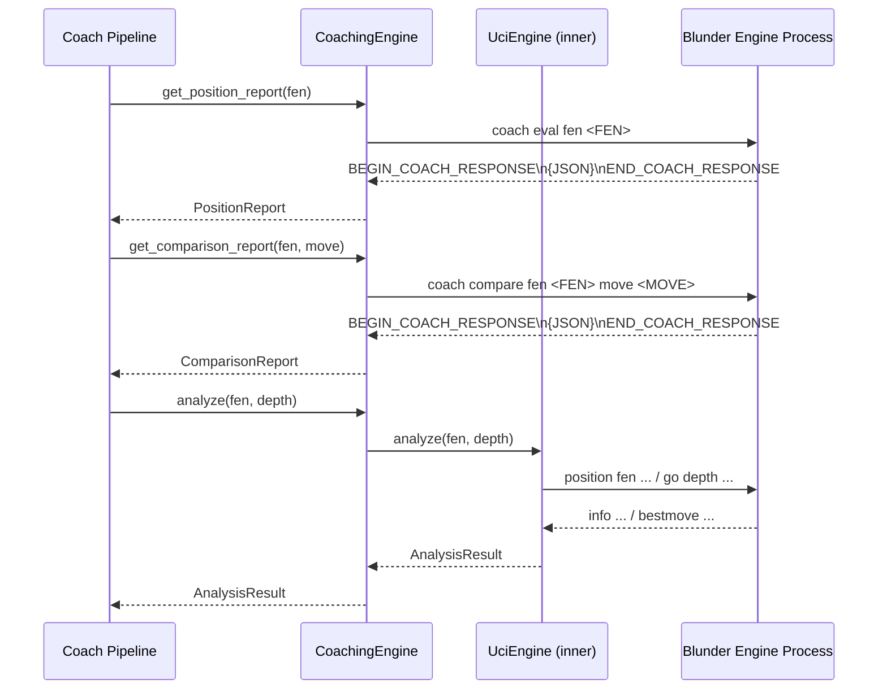
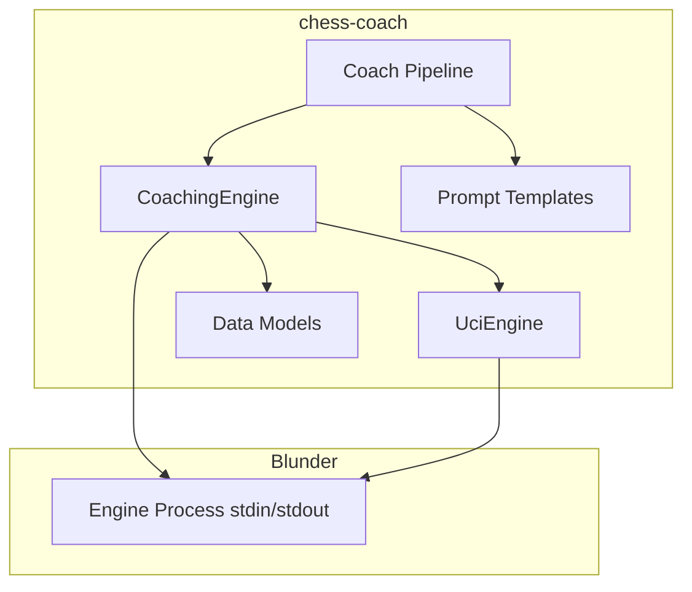
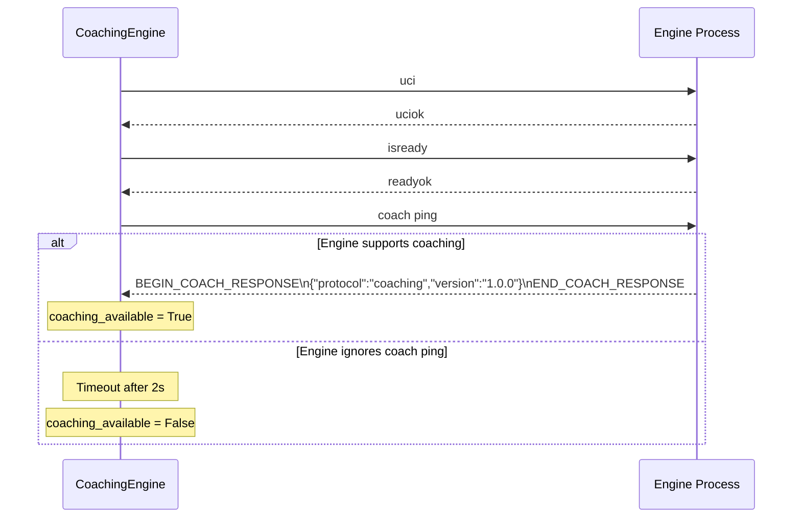

# Design Document: Engine Coaching Protocol

## Overview

This design extends the chess-coach ↔ Blunder communication layer with a custom "coaching protocol" that runs alongside UCI over the same stdin/stdout subprocess pipe. The protocol lets chess-coach request rich, structured evaluation data (material breakdown, threats, tactics, pawn structure, king safety, multi-PV lines) from Blunder via `coach` commands that return JSON responses delimited by markers.

On the chess-coach side, a new `CoachingEngine` class (implementing `EngineProtocol`) wraps `UciEngine`, adds coaching command support, and falls back to pure UCI when the connected engine doesn't speak the coaching protocol. The `Coach` pipeline gains new prompt templates that present structured engine data to the LLM, shifting the LLM's role from "chess analyst" to "chess explainer."

The primary deliverable is a standalone protocol specification document (`docs/coaching-protocol.md`) that serves as the shared contract between the chess-coach and Blunder repositories.

### Design Rationale

- **Same pipe, no new transport**: Coaching commands share the existing stdin/stdout subprocess pipe. This avoids sockets, HTTP, or a second process. The `coach` prefix ensures no collision with UCI commands.
- **JSON responses with markers**: Each coaching response is a block of JSON lines bracketed by `BEGIN_COACH_RESPONSE` / `END_COACH_RESPONSE` markers. This makes parsing unambiguous even if the engine emits interleaved UCI info lines.
- **Graceful fallback**: `coach ping` at startup probes for protocol support. If the engine doesn't respond, `CoachingEngine` behaves identically to `UciEngine`. This means chess-coach works with Stockfish or any UCI engine out of the box.
- **Composition over inheritance**: `CoachingEngine` wraps a `UciEngine` instance (composition) rather than subclassing it. This keeps UCI logic untouched and makes testing easier (mock the inner engine).

## Architecture



### Component Diagram



### Startup / Handshake Flow



## Components and Interfaces

### 1. CoachingEngine (src/chess_coach/engine.py)

Implements `EngineProtocol`. Wraps a `UciEngine` for standard UCI operations and adds coaching protocol methods.

```python
class CoachingEngine(EngineProtocol):
    def __init__(self, path: str | Path, args: list[str] | None = None,
                 coaching_timeout: float = 30.0, ping_timeout: float = 2.0):
        ...

    # EngineProtocol interface (delegated to inner UciEngine)
    def start(self) -> None: ...
    def stop(self) -> None: ...
    def analyze(self, fen: str, depth: int = 18, time_limit: float | None = None) -> AnalysisResult: ...
    def is_ready(self) -> bool: ...
    def play(self, fen: str, depth: int = 18, time_limit: float | None = None) -> str: ...

    # Coaching protocol
    @property
    def coaching_available(self) -> bool: ...

    def get_position_report(self, fen: str, multipv: int = 3) -> PositionReport: ...
    def get_comparison_report(self, fen: str, user_move: str) -> ComparisonReport: ...

    # Internal
    def _send_coaching_command(self, cmd: str) -> dict: ...
    def _probe_coaching_protocol(self) -> bool: ...
```

### 2. Data Models (src/chess_coach/models.py — new file)

All coaching protocol data models as Python dataclasses with JSON serialization/deserialization.

### 3. Updated Coach Pipeline (src/chess_coach/coach.py)

The `Coach` class gains branching logic: when `coaching_available` is True, it calls `get_position_report()` / `get_comparison_report()` and uses rich prompt templates. When False, existing UCI flow is unchanged.

### 4. New Prompt Templates (src/chess_coach/prompts.py)

Two new templates:
- `RICH_COACHING_PROMPT` — for position explanation with structured PositionReport data
- `RICH_MOVE_EVALUATION_PROMPT` — for move evaluation with ComparisonReport data

### 5. Protocol Specification (docs/coaching-protocol.md)

Standalone versioned document defining all commands, JSON schemas, response format, and examples. This is the shared contract between chess-coach and Blunder.


## Data Models

All models live in a new `src/chess_coach/models.py` file as frozen dataclasses with `to_dict()` / `from_dict()` class methods for JSON round-tripping.

### PositionReport

The top-level response from `coach eval`. Contains everything the LLM needs to explain a position.

```python
@dataclass(frozen=True)
class EvalBreakdown:
    material: int       # centipawns
    mobility: int       # centipawns
    king_safety: int    # centipawns
    pawn_structure: int  # centipawns

@dataclass(frozen=True)
class HangingPiece:
    square: str    # e.g. "f5"
    piece: str     # e.g. "bishop"
    color: str     # "white" or "black"

@dataclass(frozen=True)
class Threat:
    type: str          # "check", "capture", "fork", "pin", "skewer", "discovered_attack"
    source_square: str  # e.g. "c3"
    target_squares: list[str]  # e.g. ["e4", "a4"]
    description: str    # human-readable, e.g. "Nc3 forks Ra4 and e4 pawn"

@dataclass(frozen=True)
class PawnFeatures:
    isolated: list[str]   # files, e.g. ["a", "d"]
    doubled: list[str]    # files
    passed: list[str]     # files

@dataclass(frozen=True)
class KingSafety:
    score: int          # centipawns component
    description: str    # e.g. "king exposed, missing g-pawn shield"

@dataclass(frozen=True)
class TacticalMotif:
    type: str              # "fork", "pin", "skewer", "discovered_attack",
                           # "back_rank_threat", "overloaded_piece"
    squares: list[str]     # squares involved
    pieces: list[str]      # pieces involved, e.g. ["Nc7", "Ra8", "Ke8"]
    in_pv: bool            # True if motif appears in PV, False if on board now
    description: str       # e.g. "Fork: Nc7 attacks Ra8 and Ke8"

@dataclass(frozen=True)
class ThreatMapEntry:
    square: str             # e.g. "f7"
    piece: str | None       # piece on square, or None if empty
    white_attackers: int
    black_attackers: int
    white_defenders: int
    black_defenders: int
    net_attacked: bool      # True if piece is attacked more than defended

@dataclass(frozen=True)
class PVLine:
    depth: int
    eval_cp: int
    moves: list[str]       # UCI notation
    theme: str             # e.g. "kingside attack", "central pawn break"

@dataclass(frozen=True)
class PositionReport:
    fen: str
    eval_cp: int
    eval_breakdown: EvalBreakdown
    hanging_pieces: dict[str, list[HangingPiece]]  # {"white": [...], "black": [...]}
    threats: dict[str, list[Threat]]                # {"white": [...], "black": [...]}
    pawn_structure: dict[str, PawnFeatures]          # {"white": ..., "black": ...}
    king_safety: dict[str, KingSafety]               # {"white": ..., "black": ...}
    top_lines: list[PVLine]
    tactics: list[TacticalMotif]
    threat_map: list[ThreatMapEntry]
    critical_moment: bool
    critical_reason: str | None  # None when critical_moment is False
```

### ComparisonReport

The response from `coach compare`. Contains everything the LLM needs to evaluate a user's move.

```python
@dataclass(frozen=True)
class ComparisonReport:
    fen: str
    user_move: str                  # UCI notation
    user_eval_cp: int
    best_move: str                  # UCI notation
    best_eval_cp: int
    eval_drop_cp: int
    classification: str             # "good", "inaccuracy", "mistake", "blunder"
    nag: str                        # "!!", "!", "!?", "?!", "?", "??"
    best_move_idea: str             # why the best move is strong
    refutation_line: list[str] | None  # opponent's punishing line (blunders only)
    missed_tactics: list[TacticalMotif]
    top_lines: list[PVLine]         # engine's top N lines for context
    critical_moment: bool
    critical_reason: str | None
```

### JSON Schema Validation

The `models.py` module will include a `validate_position_report(data: dict) -> PositionReport` function that:
1. Checks all required top-level keys exist
2. Validates types of each field (int, str, list, object)
3. Validates nested objects (EvalBreakdown fields, ThreatMapEntry fields, etc.)
4. Raises `CoachingProtocolError` with the specific field/constraint that failed

Similarly, `validate_comparison_report(data: dict) -> ComparisonReport`.

No external schema library is needed — validation is straightforward type checking in Python, keeping dependencies minimal.

### Protocol Response Format

All coaching responses use the same envelope:

```
BEGIN_COACH_RESPONSE
{"protocol": "coaching", "version": "1.0.0", "type": "position_report", "data": { ... }}
END_COACH_RESPONSE
```

The `CoachingEngine._send_coaching_command()` method:
1. Writes the command to stdin
2. Reads lines until `END_COACH_RESPONSE`
3. Extracts the JSON between the markers
4. Parses the envelope, checks `protocol` and `version`
5. Passes `data` to the appropriate validator

### Coach Pipeline Integration

The `Coach` class methods branch on `self.engine.coaching_available`:

**`explain()` method:**
- Coaching available: calls `engine.get_position_report(fen)` → formats with `build_rich_coaching_prompt()` → LLM
- Coaching unavailable: existing flow via `analyze_position()` → `format_analysis_for_llm()` → LLM

**`evaluate_move()` method:**
- Coaching available: calls `engine.get_comparison_report(fen, move)` → formats with `build_rich_move_evaluation_prompt()` → LLM. Single engine round-trip replaces two separate UCI analyses.
- Coaching unavailable: existing flow with two `analyze_position()` calls

**`play_move()` method:**
- Coaching available: `get_comparison_report()` for user move eval + `engine.play()` for engine response + `get_position_report()` for engine move explanation. Two coaching calls + one UCI call vs. three UCI analyses + two LLM calls.
- Coaching unavailable: existing flow unchanged

### Prompt Templates for Rich Data

Two new templates in `prompts.py`:

**`RICH_COACHING_PROMPT`** — presents PositionReport fields as labeled sections:
- Material balance (from eval_breakdown.material)
- Piece activity / mobility
- Pawn structure (isolated, doubled, passed)
- King safety (per side)
- Threats and hanging pieces (omitted if empty)
- Tactical motifs (omitted if empty)
- Top engine lines with themes
- Critical moment flag (triggers more detailed LLM explanation)
- Instructs LLM to explain the provided data, not add its own analysis

**`RICH_MOVE_EVALUATION_PROMPT`** — presents ComparisonReport fields:
- User move vs best move with eval drop
- NAG annotation
- Classification
- What the best move achieves (best_move_idea)
- Missed tactics (omitted if empty)
- Refutation line (blunders only)
- Critical moment context
- Instructs LLM to explain what was missed, not re-analyze

Both templates conditionally omit empty sections (no threats → no threats section) to keep prompts short.

## Error Handling

| Error Condition | Behavior |
|---|---|
| `coach ping` timeout | `coaching_available = False`, fall back to UCI silently |
| `coach eval` / `coach compare` timeout (default 30s) | Raise `CoachingTimeoutError` with command text |
| Engine process dies mid-command | Detect via `proc.poll()`, raise `EngineTerminatedError`, set `_stopped = True` |
| Malformed JSON in response | Raise `CoachingParseError` with raw response text for debugging |
| JSON doesn't match schema | Raise `CoachingValidationError` with field name and expected type |
| Invalid FEN passed to coaching command | Raise `ValueError` before sending to engine |
| Timeout/parse error recovery | Engine remains usable — no corrupted internal state. The marker-based protocol means partial reads don't leave stale data in the pipe (we drain until `END_COACH_RESPONSE` or timeout) |

All coaching-specific exceptions inherit from a base `CoachingProtocolError`:

```python
class CoachingProtocolError(Exception): ...
class CoachingTimeoutError(CoachingProtocolError): ...
class CoachingParseError(CoachingProtocolError): ...
class CoachingValidationError(CoachingProtocolError): ...
class EngineTerminatedError(CoachingProtocolError): ...
```

### Version Compatibility

`coach ping` returns the engine's protocol version. `CoachingEngine` stores an `EXPECTED_VERSION = "1.0.0"`. On startup:
- If major versions differ → log warning, set `coaching_available = False` (breaking change)
- If minor versions differ → log info, proceed (backward-compatible additions)
- If patch versions differ → proceed silently


## Correctness Properties

*A property is a characteristic or behavior that should hold true across all valid executions of a system — essentially, a formal statement about what the system should do. Properties serve as the bridge between human-readable specifications and machine-verifiable correctness guarantees.*

### Property 1: PositionReport round-trip serialization

*For any* valid PositionReport object, serializing it to a dict via `to_dict()`, then reconstructing via `PositionReport.from_dict()`, should produce an object equal to the original.

**Validates: Requirements 2.2, 2.4, 3.4, 3.5**

### Property 2: ComparisonReport round-trip serialization

*For any* valid ComparisonReport object, serializing it to a dict via `to_dict()`, then reconstructing via `ComparisonReport.from_dict()`, should produce an object equal to the original.

**Validates: Requirements 4.1, 4.2**

### Property 3: Response marker extraction

*For any* JSON-serializable dict, wrapping it in `BEGIN_COACH_RESPONSE` / `END_COACH_RESPONSE` markers and feeding the resulting lines to the response parser should yield the original dict.

**Validates: Requirements 1.2**

### Property 4: Schema validation rejects invalid data

*For any* dict that is missing a required PositionReport field or has a field with the wrong type, calling `validate_position_report()` should raise a `CoachingValidationError` whose message contains the name of the offending field.

**Validates: Requirements 3.1, 3.2**

### Property 5: Coaching command formatting

*For any* coaching command type ("eval", "compare", "ping") and valid parameters, the formatted command string sent to the engine should be a single line starting with `coach ` followed by the command type and parameters.

**Validates: Requirements 1.1, 2.1, 4.1**

### Property 6: Blunder classification requires refutation line

*For any* ComparisonReport where `classification` is `"blunder"`, the `refutation_line` field must be a non-empty list. For any ComparisonReport where `classification` is not `"blunder"`, `refutation_line` may be None or empty.

**Validates: Requirements 4.4**

### Property 7: NAG threshold mapping

*For any* integer eval_drop value, the computed NAG symbol must match the threshold rules: `!!` for brilliant (only winning move in losing position), `!` for eval_drop ≤ 10, `!?` for 11–30, `?!` for 31–100, `?` for 101–300, `??` for > 300. Additionally, *for any* ComparisonReport where user_move equals best_move, the NAG must be `!` or `!!`.

**Validates: Requirements 10.2, 10.3**

### Property 8: Rich position prompt completeness and omission

*For any* PositionReport, formatting it with the rich coaching prompt template should produce a string that contains a labeled section for every non-empty field (material balance, mobility, pawn structure, king safety, threats, hanging pieces, tactics, threat map, top lines) and omits sections for fields that are empty. When `critical_moment` is True, the prompt should contain language requesting detailed explanation.

**Validates: Requirements 7.2, 8.1, 8.3, 11.4, 12.4, 14.3**

### Property 9: Rich move evaluation prompt completeness

*For any* ComparisonReport, formatting it with the rich move evaluation prompt template should produce a string that contains the user move, best move, eval drop, classification, NAG, and best_move_idea. When `missed_tactics` is non-empty, the prompt should contain the tactic descriptions. When `refutation_line` is present, the prompt should contain the refutation moves.

**Validates: Requirements 8.2**

### Property 10: Malformed JSON raises parse error with raw text

*For any* non-JSON string wrapped in coaching response markers, parsing the response should raise a `CoachingParseError` whose message contains the raw response text (or a prefix of it for very long responses).

**Validates: Requirements 6.3**

### Property 11: ThreatMapEntry net_attacked invariant

*For any* ThreatMapEntry where a piece is present, `net_attacked` should be True if and only if the number of attackers of the opposing color exceeds the number of defenders of the piece's color.

**Validates: Requirements 12.3**

### Property 12: critical_moment implies critical_reason

*For any* PositionReport where `critical_moment` is True, `critical_reason` must be a non-empty string. For any PositionReport where `critical_moment` is False, `critical_reason` must be None.

**Validates: Requirements 14.1, 14.2**

### Property 13: Version compatibility logic

*For any* two semver version strings, the compatibility check should return incompatible when major versions differ, compatible-with-warning when minor versions differ (engine minor > expected minor), and fully compatible when versions match or only patch differs.

**Validates: Requirements 15.4**

## Testing Strategy

### Framework

- **Unit tests**: `pytest` (already in use)
- **Property-based tests**: `hypothesis` (already a dev dependency)
- Both are complementary: unit tests cover specific examples, edge cases, and integration points; property tests verify universal invariants across generated inputs.

### Property-Based Testing Configuration

- Library: **Hypothesis** (`hypothesis>=6.0`, already in `pyproject.toml` dev deps)
- Minimum iterations: **100 per property** (use `@settings(max_examples=100)`)
- Each property test must be tagged with a comment: `# Feature: engine-coaching-protocol, Property N: <title>`
- Each correctness property above maps to exactly one `@given(...)` test function

### Generators (Hypothesis Strategies)

Custom Hypothesis strategies for generating random instances of each data model:

- `st_eval_breakdown()` → random `EvalBreakdown` with int fields in [-2000, 2000]
- `st_hanging_piece()` → random `HangingPiece` with valid square/piece/color
- `st_threat()` → random `Threat` with valid type, squares, description
- `st_pawn_features()` → random `PawnFeatures` with valid file lists
- `st_king_safety()` → random `KingSafety` with score and description
- `st_tactical_motif()` → random `TacticalMotif` with valid type, squares, pieces
- `st_threat_map_entry()` → random `ThreatMapEntry` with valid counts
- `st_pv_line()` → random `PVLine` with depth, eval, moves, theme
- `st_position_report()` → full `PositionReport` composing all sub-strategies
- `st_comparison_report()` → full `ComparisonReport` composing sub-strategies

### Unit Test Coverage

Unit tests (non-property) should cover:
- **Integration**: CoachingEngine startup handshake with mock engine process
- **Fallback**: coaching_available=False delegates to UCI
- **Timeout**: mock engine that never sends END_COACH_RESPONSE
- **Process death**: mock engine that exits mid-command
- **Pipeline branching**: Coach.explain() uses rich prompt when coaching available
- **Prompt templates**: specific examples of formatted prompts with known data
- **Edge cases**: empty tactics/threats/hanging_pieces, FEN validation, NAG for top-move match

### Test File Organization

```
tests/
  test_models.py              # Property tests for data model round-trips (Properties 1, 2, 6, 11, 12)
  test_coaching_protocol.py   # Property tests for protocol parsing (Properties 3, 4, 5, 10, 13)
  test_coaching_prompts.py    # Property tests for prompt formatting (Properties 8, 9)
  test_nag.py                 # Property test for NAG mapping (Property 7)
  test_coaching_engine.py     # Unit/integration tests for CoachingEngine
  test_coach_integration.py   # Unit tests for Coach pipeline branching
```
