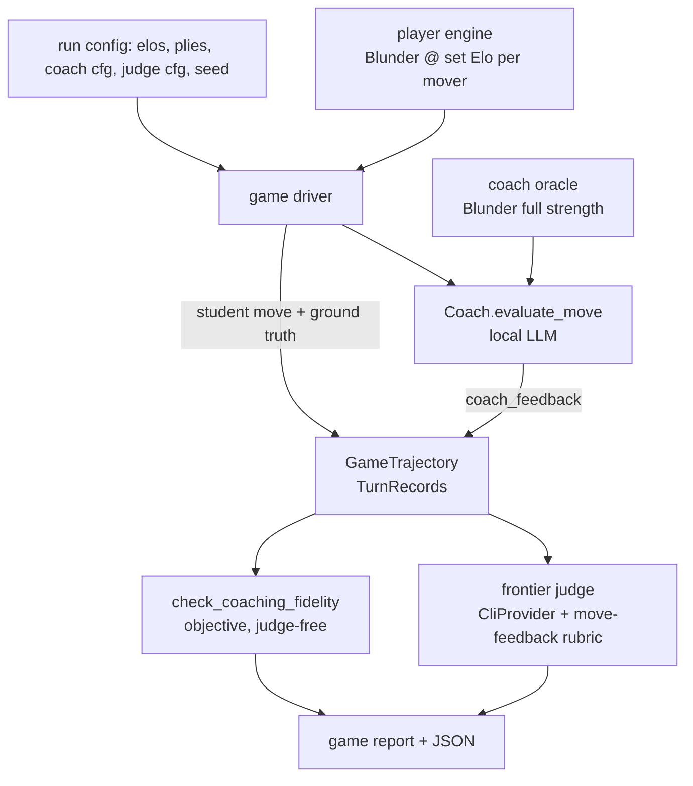

# Design Document

End-to-end game-coaching eval — a game driver + trajectory + frontier
judging, assembled almost entirely from shipped parts.

## Overview

Play a full game between two Blunder players at chosen Elos, coach the
student side's moves with the real `Coach.evaluate_move` pipeline (grounded
by a separate full-strength coach oracle), capture a serializable
**game trajectory**, and score each coaching turn with the frontier judge
(`CliProvider`) reusing the move-feedback rubric. Emit a per-game report
plus an objective fidelity layer. Runs as a `scripts/` driver over a pure,
unit-testable `eval/` core.

The insight: a played game is just a *generator* of move-feedback
scenarios. Today `move_feedback.yaml` hand-curates `(position, move)`
scenarios; here the game driver produces them from real play, then hands
them to the same coaching + judging machinery.

## Architecture



Three Blunder roles, kept distinct so reduced play strength never leaks
into analysis:
- **player engine** — one instance; `UCI_Elo` set to the student's or
  opponent's level before each move.
- **coach oracle** — a second instance at full strength, wrapped by the
  `Coach` under test.
- (The judge is external via kiro-cli; not a Blunder role.)

## Components and Interfaces

### Pure core — `src/chess_coach/eval/game_coaching.py`

Depends only on `models`, `python-chess`, and small injected callables, so
it is fully unit-testable with fakes (no live engine/LLM/judge).

```python
@dataclass(frozen=True)
class TurnRecord:
    ply: int
    fen_before: str
    student_move: str          # UCI
    engine_best: str           # UCI
    eval_before_cp: int
    eval_after_cp: int
    eval_drop_cp: int
    classification: str        # good/inaccuracy/blunder
    active_features: list[str] # dimension tags (reuse pedagogy features)
    coach_feedback: str
    fidelity_kinds: dict[str, int]   # from check_coaching_fidelity
    def to_dict(self)/from_dict(...)

@dataclass(frozen=True)
class GameTrajectory:
    meta: dict            # elos, seed, start fen, student color, coach cfg
    turns: list[TurnRecord]
    result: str           # "1-0" | "0-1" | "1/2-1/2" | "ply-cap"
    def to_dict(self)/from_dict(...)

# Ports (injected) keep the loop pure and testable:
MoveFn      = Callable[[str, int], str]         # (fen, elo) -> uci   (player)
CoachFn     = Callable[[str, str], CoachTurn]   # (fen, move) -> feedback+ground truth
def play_game(start_fen, student_elo, opponent_elo, student_is_white,
              ply_cap, move_fn, coach_fn, seed) -> GameTrajectory
def aggregate(traj, verdicts) -> GameReport
```

`play_game` alternates `move_fn` for both sides, and for each **student**
move calls `coach_fn` (which runs `Coach.evaluate_move` + records the
comparison-report ground truth + `check_coaching_fidelity`). It never
imports the engine or LLM directly — the driver script wires the real
implementations in.

### Driver — `scripts/eval_game_coaching.py`

Wires the real components (mirrors `eval_run.py` / the move-feedback
harness):
- builds a **player** `CoachingEngine` and a **coach-oracle**
  `CoachingEngine` (both via `_build_engine`), the `Coach` under test over
  the oracle, the local LLM provider, and the judge `CliProvider`;
- provides `move_fn` = set player Elo then `player_engine.play(fen, depth)`;
- provides `coach_fn` = `coach.evaluate_move(fen, move)` +
  `oracle.get_comparison_report` + `check_coaching_fidelity`;
- runs `play_game`, judges each turn (unless `--no-judge`), aggregates,
  writes trajectory + verdicts + report to `--out`.
- CLI args per Req 6.2; argparse like `eval_run.py`.

### Judging — reuse

Per turn, build the move-feedback judge input from the `TurnRecord`'s
ground truth (comparison report) and the coach feedback, and call the
frontier judge (`CliProvider.generate`, temperature 0). Reuse the
move-feedback rubric and the existing judge parse/verdict path; a parse or
provider error is caught and the turn recorded un-judged (Req 3.3).
(v2: a game-level pass that sends the whole trajectory for consistency /
critical-moment / non-repetition assessment.)

### Report — `eval/game_coaching.py::aggregate` + a renderer

Per-turn table (ply, SAN move, classification, quality) + game aggregate
(mean quality over judged turns, counts by classification, judged/
un-judged, mean fidelity violations) + a **surfaced-issues** list (engine/
coach/judge exceptions, empty/illegal coach outputs). Written as text +
JSON to the out dir, like the other tools.

## Data Models

New: `TurnRecord`, `GameTrajectory`, `GameReport` (all frozen,
`to_dict`/`from_dict`). No changes to engine models. Reuses
`ComparisonReport`, `PositionReport`, `MenuMove`, `JudgeVerdict`.

## Reuse map (what is NOT new)

- `Coach.evaluate_move` — coaching (move-feedback path).
- `CoachingEngine.play` + `UCI_LimitStrength`/`UCI_Elo` — leveled play.
- `CoachingEngine.get_comparison_report` / `get_position_report` — ground
  truth + features.
- `verify.check_coaching_fidelity` + `build_move_menu` — objective layer.
- `eval/judge.py` + move-feedback rubric + `CliProvider` — frontier judge.
- `pedagogy` features / `theme_map` — `active_features` tagging.
- kiro-monitor — long unattended runs.

## Correctness Properties

### Property 1: Loop faithfulness
`play_game` over a scripted fake `move_fn` produces exactly one
`TurnRecord` per student move, in ply order, and terminates at game end or
the ply cap. **Validates: Requirements 1.1, 1.2, 1.3**

### Property 2: Trajectory round-trip
`from_dict(to_dict(traj)) == traj` for any trajectory; a saved trajectory
can be judged without replaying the game. **Validates: Requirements 4.1, 4.3**

### Property 3: Oracle strength isolation
The coach-oracle engine's options are never mutated by the player-Elo
setting (distinct instances / guarded), so coaching ground truth is
full-strength regardless of student Elo. **Validates: Requirements 2.3**

### Property 4: Judge-optional / failure isolation
With judging disabled the run still produces a complete trajectory +
objective report; a judge error on one turn yields an un-judged turn, not
an aborted run. **Validates: Requirements 3.2, 3.3, 5.3**

### Property 5: Aggregate correctness
`aggregate` computes mean quality over judged turns only, correct
classification counts, and correct judged/un-judged totals over crafted
inputs. **Validates: Requirements 5.1**

## Error Handling

- Engine play error / illegal move from a player → end the game, record the
  result as an error termination, surface it.
- Coach exception / empty feedback → record the turn with empty feedback +
  a surfaced issue; continue.
- Judge provider/parse error → un-judged turn (Req 3.3).
- Bad FEN / config → fail fast at startup with a clear message.

## Testing strategy

- **Property/unit (pure core, no I/O):** Properties 1–5 with a scripted
  fake `move_fn` (a canned move list) and a fake `coach_fn`; trajectory
  round-trip; aggregate math; ply-cap and natural-termination paths.
- **Smoke (driver):** one very short game (small ply cap), `--no-judge`,
  against the real local engine if available else skipped — asserts a
  trajectory + report are written. CI-safe.
- **Judge adapter:** a fake `CliProvider` returning a canned verdict →
  per-turn verdict recorded; a raising provider → un-judged turn.

## Sequencing

1. Pure core: `TurnRecord`/`GameTrajectory`/`GameReport` + `play_game` +
   `aggregate`, fully unit-tested with fakes.
2. Driver script wiring real engines/coach/judge; trajectory + report I/O.
3. Objective fidelity per turn (reuse `check_coaching_fidelity`).
4. Frontier judging per turn (reuse judge + rubric + `CliProvider`).
5. Smoke + docs; first real run under kiro-monitor.
6. (v2, deferred) game-level judging pass.

The core (1) has no engine/LLM/judge dependency, so it lands and is proven
before any live wiring — the same discipline the other eval tools follow.
