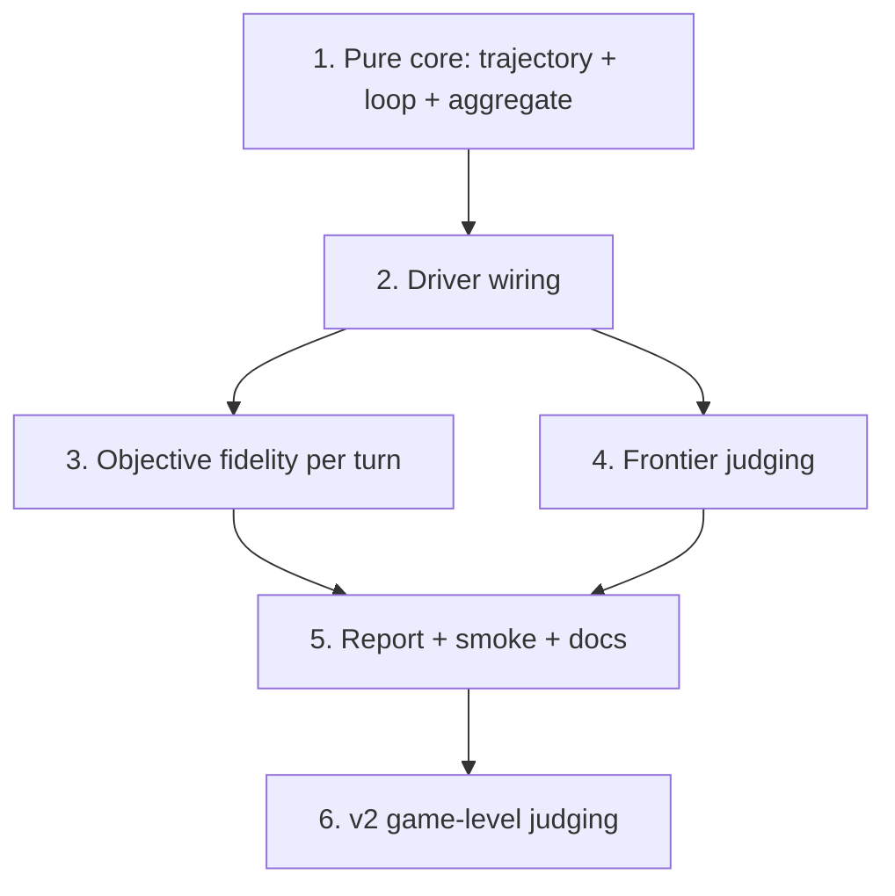

# Implementation Plan

## Overview

Build the pure, testable core first (game loop + trajectory + aggregation
over injected fakes — no engine/LLM/judge), then wire the real driver, the
objective fidelity layer, and the frontier judge, then smoke + docs. This
mirrors the other eval tools (`eval_run.py`, the move-feedback harness):
the deterministic core is proven before any live dependency.

Conventions: Python 3.11, `src/` layout, `uv run pytest` / `uv run mypy
src` (strict) / `uv run ruff check src tests scripts` + `ruff format
--check`. Offline/local; the only external call is the operator-configured
kiro-cli judge (the sanctioned eval judge). Reuse `Coach.evaluate_move`,
`CoachingEngine` (play + reports), `verify.check_coaching_fidelity`,
`eval/judge.py` + move-feedback rubric + `CliProvider`, pedagogy features,
and kiro-monitor — build only the driver + trajectory + aggregation.

## Tasks

- [x] 1. Pure core — trajectory + game loop + aggregation
  - [x] 1.1 `src/chess_coach/eval/game_coaching.py`: `TurnRecord`,
        `GameTrajectory`, `GameReport` dataclasses with
        `to_dict`/`from_dict` (frozen, serializable).
  - [x] 1.2 `play_game(...)` — alternates `move_fn` per side, calls
        `coach_fn` on student moves, builds the trajectory, terminates on
        game over / ply cap / illegal-move error / bad start FEN. Pure over
        injected callables (no engine/LLM import).
  - [x] 1.3 `aggregate(traj, verdicts) -> GameReport` — mean quality over
        judged turns only, classification counts, judged/un-judged totals,
        mean fidelity violations, surfaced issues (game-level + per-turn
        empty-feedback / illegal / off_menu). `GameReport.render()`.
  - [x] 1.4 Tests (Properties 1, 2, 5, 12 cases): one TurnRecord per
        student move in ply order, student=White/Black, natural termination
        (Scholar's mate), illegal-move error, bad-FEN, empty-feedback flag,
        trajectory round-trip (+ property), aggregate math, judge-optional,
        issue surfacing, render smoke.
  - _Requirements: 1.1, 1.2, 1.3, 4.1, 4.2, 4.3, 5.1, 8.2_

- [x] 2. Driver script — wire the real components
  - [x] 2.1 `scripts/eval_game_coaching.py`: builds a **player**
        `CoachingEngine` and a distinct **coach-oracle** `CoachingEngine`
        (both via `_build_engine`), the `Coach` under test over the oracle,
        the local LLM provider, argparse per Req 6.2, output-dir I/O.
  - [x] 2.2 `_make_move_fn` sets player `UCI_LimitStrength`/`UCI_Elo` for
        the mover then `player.play(fen, depth)`; the oracle is a separate
        instance so its full strength is never touched (Property 3 by
        construction).
  - [x] 2.3 `_make_coach_fn` = `oracle.get_position_report` (engine best +
        menu + `active_features` via `extract_features`) +
        `coach.evaluate_move` (feedback/classification/evals); writes the
        trajectory JSON per game.
  - _Requirements: 1.4, 2.1, 2.2, 2.3, 6.1, 6.2, 7.1_

- [x] 3. Objective fidelity per turn (judge-free layer)
  - [x] 3.1 `check_coaching_fidelity` (+ `build_move_menu`) runs on each
        coaching turn; `fidelity_kinds` stored on the `TurnRecord`;
        `aggregate` surfaces illegal/off_menu + empty-feedback-on-a-mistake
        as issues (empty feedback on a *good* move is not flagged — the
        coach legitimately stays silent).
  - _Requirements: 5.3, 5.1_

- [ ] 4. Frontier judging per turn — BLOCKED on a design decision
  - [ ] 4.1 DECISION NEEDED: there is **no absolute move-feedback rubric**
        today — the move-feedback path only has *pairwise* judging
        (`build_pairwise_prompt`); rubric.v1/v2 are position-explanation
        rubrics keyed to a `BenchmarkPosition`/`PositionReport`, not a
        `ComparisonReport`. So per-move absolute judging needs one of:
        (a) a small new move-feedback judge prompt + rubric over the
        `ComparisonReport` ground truth; (b) reuse rubric.v2 criteria via a
        new comparison-report adapter; (c) reframe as pairwise (two coach
        configs over the same game). Also needs kiro-cli available. Judging
        stays **off by default** regardless (Req 3.2), so the tool is fully
        useful judge-free until this lands.
  - [ ] 4.2 Failure isolation + re-judge-from-saved-trajectory (once 4.1
        is decided). `aggregate` already accepts a `ply -> quality` verdict
        map and treats absent plies as un-judged (Property 4 core is done).
  - [ ] 4.3 Tests with a fake provider.
  - _Requirements: 3.1, 3.2, 3.3, 7.2_

- [ ] 5. Report + smoke + docs
  - [x] 5.1 `GameReport.render()` (text) + per-game trajectory JSON +
        `report.txt` written to `--out`, with the surfaced-issues list.
  - [x] 5.2 Smoke: validated end-to-end via a 10-ply `--template-only`
        game (no tunnel needed) — played at student/opponent Elo, coached 5
        student moves, 0 fidelity violations, trajectory + report written.
        (A live LLM/judge run is pending tunnel + Task 4.)
  - [ ] 5.3 Full green (pytest/mypy/ruff/format — currently green). Docs
        note + kiro-monitor launch example, and record the first real
        (LLM, judged) run's findings in BACKLOG — pending tunnel + Task 4.
  - _Requirements: 5.1, 5.2, 6.3, 8.1, 8.3_

- [ ] 6. (v2, deferred) Game-level judging pass
  - [ ] 6.1 A judge pass over the whole trajectory: consistency, catching
        `critical_moment`s, non-repetition. Kept separate from v1 per-move
        judging.
  - _Requirements: 3.4_

## Task Dependency Graph



```json
{ "waves": [
  { "wave": 1, "tasks": ["1"] },
  { "wave": 2, "tasks": ["2"] },
  { "wave": 3, "tasks": ["3", "4"] },
  { "wave": 4, "tasks": ["5"] },
  { "wave": 5, "tasks": ["6"] }
] }
```

## Notes

- The pure core (Task 1) is the reusable **game-trajectory substrate** the
  cross-game progress tracker (separate spec) will consume — build it
  clean and serializable.
- Three Blunder roles (student-weak / opponent / full-strength coach
  oracle) via distinct instances; never let player Elo touch the oracle.
- Judge is the sanctioned frontier eval judge (kiro-cli), allowed by VISION
  as an eval judge only — never the runtime coach.
- `config.yaml` (runtime switches) stays out of this; the harness takes its
  own CLI args, like the other eval tools.
