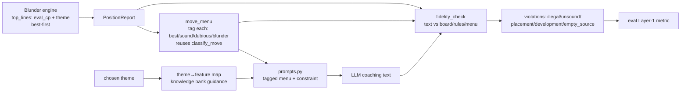

# Design Document

Grounded move advice — a tagged engine move-menu that constrains the
prompt, plus a deterministic output fidelity checker.

## Overview

Two coordinated changes, one invariant: **the engine is the sole arbiter
of whether a named move is sound.**

1. **Input side** — turn the engine's `top_lines` into a compact,
   soundness-tagged **candidate menu** and feed it to the prompt with a
   constraint: the coach may name concrete moves only from the
   `best`/`sound` tags, or stay plan-level. The chosen move's engine
   `theme` is paired to the knowledge bank for the *why*.
2. **Output side** — after generation, a pure **fidelity checker** scans
   the coaching text against the board, the rules, and the tagged menu,
   returning categorized violations. It is the safety net and the
   objective A/B metric.

Both reuse existing scaffolding: the composer (`coaching_phrases`), the
existing `classify_move` thresholds, the guidance selector, and the
hallucination detector. No engine change is required for the core: the
engine already returns per-line `eval_cp` (best-first) and a per-line
`theme`; widening the menu is passing a larger `multipv`.

## Architecture



Authority boundary (unchanged from client-side-coaching-text):
- **Engine = facts** — candidate moves, per-line eval, per-line theme.
- **Client = presentation + policy** — soundness tagging, menu wording,
  the prompt constraint, the theme→knowledge pairing, and the fidelity
  check. Each a named, tested rule.

## Components and Interfaces

### 1. Move menu + soundness tagging — `coaching_phrases`

The menu belongs with the other pure, structured-fact composers.

```python
@dataclass(frozen=True)
class MenuMove:
    san: str          # first move of the line, SAN (falls back to UCI)
    uci: str          # first move, raw UCI (for the checker)
    eval_cp: int
    drop_cp: int      # top_lines[0].eval_cp - this.eval_cp  (>= 0)
    tag: str          # "best" | "sound" | "dubious" | "blunder"
    theme: str

def build_move_menu(report: PositionReport) -> list[MenuMove]: ...
def describe_move_menu(menu: list[MenuMove]) -> str | None: ...
    # "--- Candidate moves (engine-verified) ---" block, or None if empty
```

- Tagging reuses `Coach.classify_move`'s boundaries as the single source.
  To avoid a client↔coach import cycle and keep the numbers in one place,
  the thresholds move to a module-level constant/function in
  `coaching_phrases` (e.g. `classify_drop(drop_cp) -> str`) and
  `Coach.classify_move` delegates to it. The top line is forced to
  `best` regardless of drop.
- SAN via the existing `_uci_to_san` helper (already in `prompts.py`;
  reused/relocated so the composer and checker share one converter).
- Total: empty `top_lines` → empty menu; single line → `[best]`; equal
  evals → all `sound` except index 0 = `best`.

### 2. Prompt constraint — `prompts.py`

`_format_top_lines` is replaced (in the rich, Socratic, and move-eval
builders) by `describe_move_menu`. The system/coaching instructions gain
a **move-sourcing rule**, gated by a config switch:

> When you recommend a specific move, name **only** a move listed as
> `best` or `sound` in the candidate menu above. You may instead give a
> plan (e.g. "castle to safety", "improve your worst piece") without
> naming a move. Never name a move that is not in the menu, and never
> name one tagged `dubious` or `blunder` except to warn against it.

Grounding rules already present are untouched (Req 3.3). The Socratic
prompt keeps its "don't reveal the best move" rule — it shows the menu
themes/tags but the instruction to not name the move still applies, so
the two constraints compose (it may point at *a theme* without naming the
move).

### 3. Theme ↔ knowledge-bank pairing — `pedagogy`

A documented mapping from engine `theme` → knowledge-bank `feature`
(closed vocabulary already in `knowledge.yaml`):

| engine theme            | knowledge feature(s)        |
|-------------------------|-----------------------------|
| piece development       | `phase:opening` (development)|
| king safety, castling   | `exposed_king` / king safety |
| central pawn break      | `phase:opening` (center)     |
| material win            | `hanging_piece_opponent`     |
| king attack             | `exposed_king`               |
| general play            | (no override → fallback)     |

The selector gains an optional `preferred_features` hint from the chosen
move's mapped theme; when present it biases (does not restrict) the
existing feature-based selection so the leading guidance entry matches
what the recommended move is *about*. Unmapped/`general play` → today's
behavior exactly (Req 4.2). This is additive to the guidance path already
wired through `_select_guidance` / `build_rich_coaching_prompt`.

### 4. Fidelity checker — `verify.py` (extends the rules tier)

```python
@dataclass(frozen=True)
class Violation:
    kind: str          # illegal_move|unsound_move|placement|development|empty_source
    text: str          # the offending fragment
    detail: str        # why it is wrong (e.g. "f6->e4 tagged blunder (-180cp)")

def check_coaching_fidelity(
    coaching_text: str,
    report: PositionReport,
    menu: list[MenuMove],
) -> list[Violation]: ...
```

Deterministic passes, **precision-first** (only high-confidence hits):

- **Move extraction.** A tight SAN regex (`[KQRBN]?[a-h]?[1-8]?x?[a-h]
  [1-8](=[QRBN])?[+#]?`, plus `O-O`/`O-O-O`) and a coordinate form
  (`[a-h][1-8][ -to]*[a-h][1-8]`). Each extracted move is normalized to
  UCI against the board.
  - not legal → `illegal_move`.
  - legal and equals a menu move tagged `dubious`/`blunder` →
    `unsound_move`. (Legal moves outside the menu are NOT flagged unsound
    — the menu is bounded; absence is not evidence of unsoundness. This
    keeps precision high; recall of unsound-but-unlisted moves is a
    documented limitation, mitigated by widening `multipv`.)
- **Placement claims.** Pattern `your|the <piece> on|at <square>` →
  compare `board.piece_at(square)`; contradiction → `placement`.
- **Development claims.** `<piece> (is )?(un)?developed` / "still on its
  starting square" cross-checked against `describe_placement`'s
  developed/home computation (reused, not reimplemented) → `development`.
- **Empty-source moves.** `move … from <square>` where `board` has no
  (matching) piece on `<square>` → `empty_source`.

The existing hallucination detector's board/piece checks are folded in
here so there is one rules-tier checker (Req 5.4); the checker returns
structured violations that the detector's callers consume.

### 5. Eval metric — `eval/`

A Layer-1 objective metric wraps `check_coaching_fidelity` over each
benchmark item's generated text, aggregating a violation rate per
category. The constraint switch (Req 3.4) and `multipv` width (Req 1.1)
are run parameters so a single harness invocation can A/B conditions.

## Data Models

- **New:** `MenuMove` (frozen dataclass, in `coaching_phrases`).
- **New:** `Violation` (frozen dataclass, in `verify`).
- **Unchanged engine models:** `PVLine` already carries `eval_cp`,
  `moves`, `theme`; `PositionReport.top_lines` is the menu source. No
  protocol change, no engine change for the core feature.

## Perspective / soundness correctness

The engine sorts `top_lines` best-first for the side to move;
`is_critical_moment` and the move-comparator both compute drops as
`best - other` in that same frame. Therefore
`drop_i = top_lines[0].eval_cp - top_lines[i].eval_cp` is ≥ 0 and
directly comparable to `classify_move`'s cp thresholds with **no sign
handling by side**. Tests pin this with a Black-to-move report to prevent
a future perspective regression.

## Correctness Properties

### Property 1: Tagging totality + determinism
`build_move_menu` never raises and is a pure function of `top_lines`;
identical `eval_cp` lists ⇒ identical tags; index 0 ⇒ `best`.
**Validates: Requirements 2.2, 2.3, 8.2**

### Property 2: Tag monotonicity
A larger eval-drop never yields a *safer* tag (best ≥ sound ≥ dubious ≥
blunder ordering is monotonic in `drop_cp`).
**Validates: Requirements 2.1**

### Property 3: Checker totality
`check_coaching_fidelity` never raises over arbitrary text/report/menu
and returns `[]` when no claim pattern matches.
**Validates: Requirements 5.2, 8.2**

### Property 4: Checker soundness (no false alarms on truth)
For coaching text that names only `best`/`sound` menu moves and makes
only board-true placement claims, the checker returns no violations.
**Validates: Requirements 5.1, 5.2**

### Property 5: Regression — the live failure is caught
Given the Italian position and text naming `Nf6-e4` (a `blunder`-tagged
menu move), the checker returns an `unsound_move`; given text naming the
sound `Nf6-d5`, it does not.
**Validates: Requirements 5.1, 8.3**

## Error Handling

- Bad/again-unparseable move token → skipped (not a false `illegal_move`);
  precision over recall.
- Bad FEN in the report → checker returns `[]` (cannot ground);
  logged once.
- Empty `top_lines` → empty menu; the prompt omits the menu section and
  the move-sourcing rule degrades to "give plan-level advice" (there is
  nothing sound to name).
- Unmapped theme → guidance fallback, never an error.

## Testing strategy

- **Property tests (≥100):** Properties 1–4.
- **Unit — tagging:** boundary evals (50/51/100/101 cp), equal evals,
  single line, empty, Black-to-move perspective.
- **Unit — checker precision:** the `Nf6-e4` regression, a correct-advice
  transcript (no false positive), a placement lie ("your knight on b8"
  when b8 is empty), an "undeveloped" claim when developed, an
  `empty_source` move.
- **Prompt tests:** the menu block renders with tags; the move-sourcing
  rule is present when the switch is on and absent when off; grounding
  rules still present (regression vs client-side-coaching-text sentinel).
- **Parity:** menu wording identical wherever rendered (reuse the
  existing no-prose-leak sentinel to confirm no `description` creeps in).
- **Eval smoke:** the Layer-1 metric runs on a tiny benchmark slice and
  emits per-category rates.

## Sequencing

Build pure pieces first (menu+tagging, then checker), both fully testable
with no engine and no LLM; then wire the prompt constraint and the theme
pairing; then the eval metric; then run the A/B. The output checker does
not depend on the input constraint, so the two halves can be built in
parallel and are only *jointly* required for done (non-negotiable: no
half-ship).
