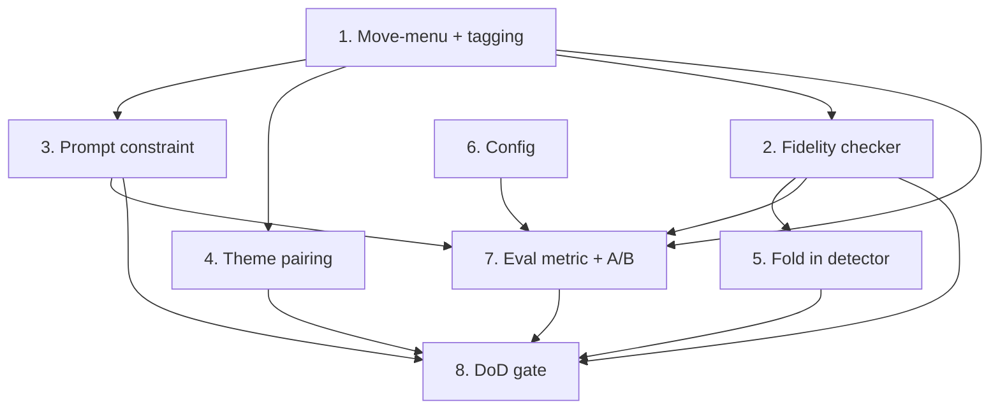

# Implementation Plan

## Overview

Build the two pure cores first — the tagged move-menu and the fidelity
checker — each fully testable with no engine and no LLM. Then wire the
prompt constraint and the theme→knowledge pairing (input side), fold the
existing hallucination detector into the checker (output side), add the
Layer-1 eval metric, and run the A/B. Nothing is "done" until BOTH the
input constraint and the output checker ship green (Task 8) — that joint
gate is the guarantee against a half-ship.

Conventions: Python 3.11, `src/` layout, `uv run pytest` / `uv run mypy
src` (strict) / `uv run ruff check src tests` + `ruff format --check`.
Offline/local, no new runtime deps. Reuse the composer
(`coaching_phrases`), the existing `classify_move` thresholds, the
guidance selector, and the hallucination detector — do not duplicate
them. No engine (Blunder) change is required.

## Tasks

- [x] 1. Tagged move-menu core (pure, in `coaching_phrases`)
  - [x] 1.1 Shared the `classify_move` cp boundaries with
        `coaching_phrases` as module constants (`SOUND_MAX_DROP_CP`,
        `DUBIOUS_MAX_DROP_CP`) + `classify_drop(drop_cp) -> str` (menu
        tags sound/dubious/blunder); `Coach.classify_move` references the
        same constants so the numbers live in one place. (Constants over
        delegation keeps the distinct label vocabularies — good/inaccuracy
        vs sound/dubious — without an ugly mapping dict.)
  - [x] 1.2 Added `MenuMove` dataclass and `build_move_menu(report)`:
        first move UCI + SAN (relocated `_uci_to_san` → public
        `coaching_phrases.uci_to_san`, shared), `eval_cp`,
        `drop_cp = max(0, top_lines[0].eval_cp - eval_cp)`, `tag`
        (index 0 forced `best`), `theme`. Total over empty/single/
        equal-eval inputs.
  - [x] 1.3 Added `describe_move_menu(menu)` → the compact
        "--- Candidate moves (engine-verified) ---" block, or None if
        empty. Reads only structured fields (no `description`).
  - [x] 1.4 Property tests (Properties 1, 2, tag-monotonicity) + unit
        tests: boundary evals (0/50/51/100/101), equal evals, single
        line, empty, lines-without-moves, negative-drop clamp, and a
        Black-to-move report (perspective regression pin). Added
        `minor_is_developed` shared helper + its unit test.
  - _Requirements: 1.2, 1.3, 1.4, 2.1, 2.2, 2.3, 8.2_

- [x] 2. Fidelity checker core (pure, in `verify.py`)
  - [x] 2.1 Added `Violation` dataclass and
        `check_coaching_fidelity(text, report, menu)`: move extraction
        (SAN + coordinate regex), normalize to UCI vs board →
        `illegal_move`; legal move matching a `dubious`/`blunder` menu
        entry → `unsound_move` (legal moves absent from the menu are NOT
        flagged — documented precision-first choice). Empty-square
        coordinate sources emit `empty_source` instead of `illegal_move`.
  - [x] 2.2 Added the placement / development / empty-source passes,
        reusing the shared `minor_is_developed` helper (extracted from
        `describe_placement`'s developed/home computation, not
        reimplemented). Final dedup collapses the same empty square
        reported by two phrasings.
  - [x] 2.3 Property tests (Property 3 totality + determinism) + curated
        precision unit tests (Properties 4, 5): the Italian `Nxe4`
        regression (unsound flagged; sound `Nd5` not), a correct-advice
        transcript (no false positive), a placement lie, a wrong-piece
        placement, a false "undeveloped", `empty_source`, a bare-square
        reference not flagged as a move, empty-menu, and bad-FEN.
  - _Requirements: 5.1, 5.2, 5.3, 8.2, 8.3_

- [x] 3. Prompt constraint (input side, `prompts.py`)
  - [x] 3.1 Replaced the `_format_top_lines` call in
        `build_rich_coaching_prompt` with the tagged
        `describe_move_menu`, and deleted the now-dead `_format_top_lines`.
        (CORRECTION vs spec: the Socratic builder deliberately omits top
        lines — showing the menu there would leak the answer — and the
        move-eval builder shows its own engine best move, so neither
        rendered `_format_top_lines`; the constraint correctly lives only
        in the rich coaching path.)
  - [x] 3.2 Added `MOVE_SOURCING_RULE` (name only `best`/`sound`;
        plan-level allowed; never invent / never name `dubious`/`blunder`
        except to warn) gated by `constrain_moves` (default on) AND a
        non-empty menu. Added an always-on SAN notation instruction (owner:
        "use SAN all the time if possible"). All existing grounding rules
        retained (Req 3.3). Threaded `constrain_moves` through `Coach` and
        both `cli.py` constructions.
  - [x] 3.3 Prompt tests: menu+tags render (SAN, not UCI); rule present
        iff switch on and menu non-empty; SAN instruction always present;
        grounding rules retained; Socratic still hides the move (existing
        test).
  - _Requirements: 3.1, 3.2, 3.3, 3.4_

- [x] 4. Theme ↔ knowledge-bank pairing (`pedagogy`)
  - [x] 4.1 Added `pedagogy/theme_map.py` with the documented
        `theme → feature` mapping (design table).
  - [x] 4.2 Threaded a `preferred_features` bias through
        `SelectionInput` / `select` / `select_for_position` /
        `guidance_for_position` as an additive tie-break in `_sort_key`
        (never admits/drops an entry). `coach._select_guidance` derives it
        from the best line's theme; unmapped/`general play` → empty →
        today's behavior.
  - [x] 4.3 Unit tests: known/unknown theme mapping; preferred features
        break a tie toward the theme; an unmatched preferred feature is a
        no-op. Existing selector property tests still green (bias never
        changes eligibility).
  - _Requirements: 4.1, 4.2, 4.3_

- [x] 5. Consolidate the hallucination detector into the checker
  - [x] 5.1 Added `verify.check_text_fidelity(text, fen, menu)` (fen-based
        sibling of `check_coaching_fidelity`, sharing `_run_fidelity_checks`).
        `eval/objective.py::check_piece_hallucinations` /
        `check_move_validity` now delegate to it and filter by kind
        (`placement` / `illegal_move`), preserving their output shape;
        removed the duplicated regex/piece-map logic (and the now-unused
        `chess` import). Objective's scoring surface is unchanged.
  - _Requirements: 5.4_

- [x] 6. Configuration
  - [x] 6.1 Raised the `top_moves` (multipv) default from 3 to 5 at all
        three CLI lookups and documented it in `config.example.yaml`.
        Added the `constrain_moves` switch (default true) to config and
        `Coach`. `multipv` already flows `Coach` → `get_position_report`.
  - [x] 6.2 `config.yaml` left UNSTAGED (owner's runtime switches); only
        `config.example.yaml` (committed) documents the new defaults.
  - _Requirements: 1.1, 7.1, 7.2_

- [x] 7. Layer-1 eval metric + A/B
  - [x] 7.1 Added `ObjectiveResult.fidelity_counts` (menu-aware violation
        breakdown via `check_coaching_fidelity` + `build_move_menu`) that
        deliberately does NOT feed `factual_score` (runs stay comparable);
        `scoring.total_unsound_moves` + `uns` scoreboard column;
        `RunConfig.constrain_moves`; `eval_run.py` gained
        `--constrain-moves/--no-constrain-moves` and `--multipv` default 5.
  - [x] 7.2 Tests: unsound flagged at the objective level (Nxe4), score
        unchanged by an unsound move, sound-move-clean, scoreboard
        aggregation. Smoke run over one position confirmed the `uns`
        column renders.
  - [x] 7.3 Ran the A/B (off vs on) on qwen3:8b AND qwen3:14b at temp 0.7
        (Layer 1, 9 positions). Results + verdict recorded in BACKLOG.
        FINDING: inconclusive on this benchmark — baseline unsound rate is
        ~0 (positions are mostly quiet), so there is nothing to reduce; the
        metric works and `factual_score` stayed flat. Surfaced two
        follow-ups (benchmark "temptation" positions; warn-against
        over-count) recorded in BACKLOG.
  - _Requirements: 6.1, 6.2, 6.3_

- [x] 8. Definition-of-done gate (joint)
  - [x] 8.1 Full green: `uv run pytest` (595), `uv run mypy src`,
        `uv run ruff check src tests scripts`, `uv run ruff format --check`
        — all clean.
  - [x] 8.2 BOTH halves live: the rich prompt names only sound menu moves
        (Task 3, verified in the live Italian run — recommended O-O, no
        `Nxe4`) AND the checker guards the output (Task 2/5, wired into the
        eval metric Task 7).
  - [x] 8.3 Updated BACKLOG (shipped note + A/B verdict + two follow-ups).
        The move-sourcing invariant is documented in the spec
        requirements; VISION's "engine grounds the concrete action" already
        states it, so no VISION edit was needed.
  - _Requirements: 8.1, 8.2, 8.3_

## Task Dependency Graph



- Tasks 1 and 2 are the pure foundations and can be built in parallel.
- The input side (3, 4) and the output side (2, 5) are independent until
  the joint DoD gate (8) — reflecting "no half-ship".
- Task 7's A/B needs the constraint (3) and the checker (2) wired.

```json
{ "waves": [
  { "wave": 1, "tasks": ["1", "2"] },
  { "wave": 2, "tasks": ["3", "4", "5", "6"] },
  { "wave": 3, "tasks": ["7"] },
  { "wave": 4, "tasks": ["8"] }
] }
```

## Notes

- No Blunder change: the engine already returns per-line `eval_cp`
  (best-first) and a per-line `theme`; the menu is a wider `multipv` plus
  client tagging.
- The menu is deliberately bounded (a handful of candidates), not the
  full legal-move list — cost, small-model prompt clarity, and VISION's
  "not a position analyst" line.
- The checker is precision-first: it flags only high-confidence
  contradictions and documents bounded recall; widening `multipv`
  improves unsound-move recall without changing the checker.
