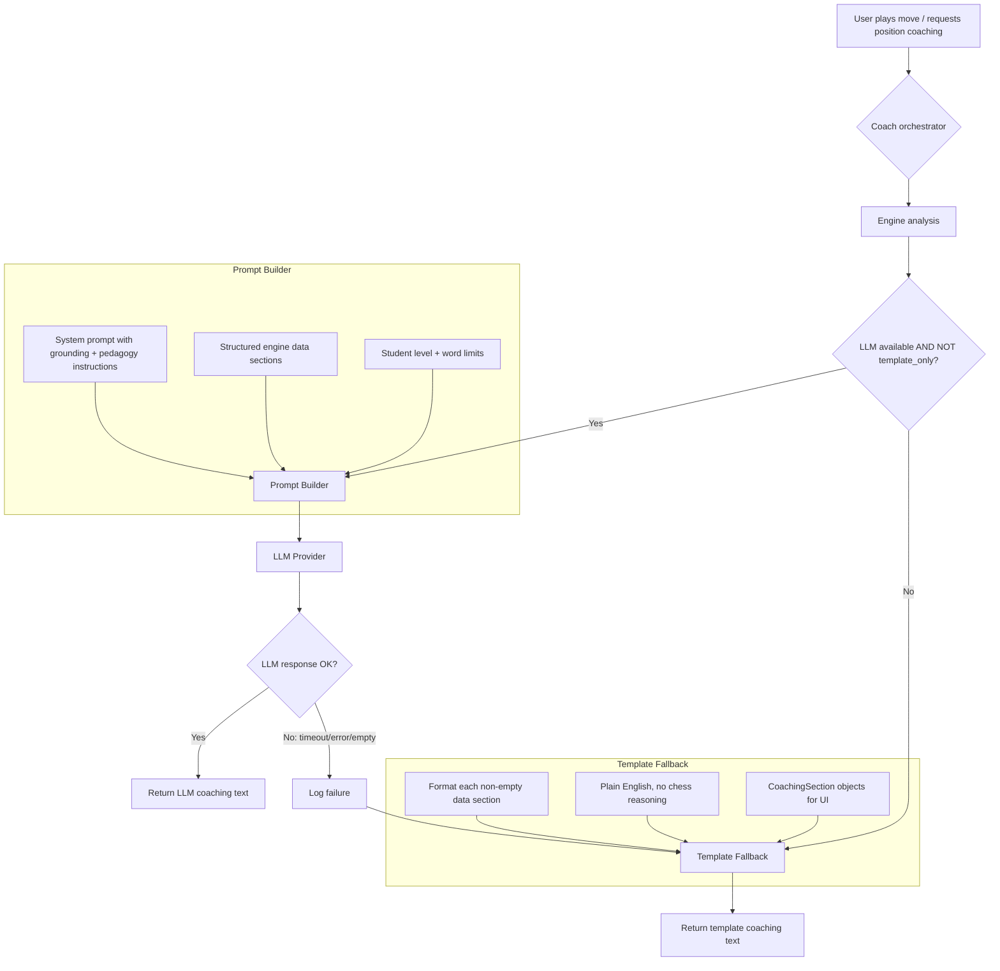

# Design Document: LLM Primary Coaching

## Overview

This feature promotes the LLM from a secondary coaching path to the primary coaching voice in chess-coach. The probe experiment (`output/llm_probe/probe_results.md`) demonstrated that Qwen3-8B produces zero hallucinations when given structured engine data (Style E), making it safe to use as the default coaching path.

The design has three pillars:

1. **LLM-first coaching** — When an LLM provider is available and `template_only` is false, all coaching text flows through the LLM with improved prompts that guide it toward prioritized, grounded, pedagogical output.
2. **Simplified template fallback** — The 840-line `coaching_templates.py` is refactored from scenario-specific if-statement trees into a clean data-presentation layer that formats engine sections into readable English. No chess reasoning, no opening-specific advice — just structured data in plain language.
3. **Hallucination detector fixes** — The probe script's `check_piece_hallucinations` function is updated to distinguish "piece on X" (placement claim) from "piece controls/attacks X" (square influence claim), eliminating false positives.

### Key Design Decision: Prompt Improvement vs. Architecture Change

The existing dual-path architecture in `coach.py` (coaching protocol path + UCI fallback) is sound. The `template_only` flag already gates LLM usage. Rather than restructuring the Coach class, this feature:

- Improves the prompt templates in `prompts.py` to produce better coaching output
- Adds graceful fallback when LLM calls fail (timeout, connection error, empty response)
- Simplifies `coaching_templates.py` by removing scenario-specific branching
- Fixes the hallucination detector regex in `scripts/probe_llm_chess.py`

The Coach class changes are minimal: add try/except around LLM calls with template fallback, and ensure the LLM path is used by default when available.

## Architecture



### Coaching Flow (Position Explanation)

1. Engine produces a `PositionReport` (structured data: eval breakdown, hanging pieces, threats, tactics, pawn structure, king safety, top lines, threat map)
2. `build_rich_coaching_prompt()` formats the report into labeled sections with grounding + pedagogical instructions
3. LLM generates natural language coaching text grounded in the engine data
4. If LLM fails → `generate_position_coaching()` from templates produces fallback text

### Coaching Flow (Move Evaluation)

1. Engine produces a `ComparisonReport` (user move vs best move, eval drop, missed tactics, refutation line)
2. `build_rich_move_evaluation_prompt()` formats the report with constructive framing instructions
3. LLM generates feedback explaining what was missed and why the best move is stronger
4. If LLM fails → `generate_move_coaching()` from templates produces fallback text

### Fallback Strategy

The fallback is per-call, not per-session. If the LLM times out on one position, the next position still tries the LLM first. This maximizes LLM usage while ensuring the user always gets coaching text.

```python
# Pseudocode for the fallback pattern
try:
    text = llm.generate(prompt, max_tokens=..., temperature=...)
    if not text.strip():
        raise ValueError("Empty LLM response")
except (Exception,) as e:
    logger.warning("LLM failed for %s: %s — falling back to templates", context, e)
    text = generate_position_coaching(report, level=level)
```

## Components and Interfaces

### 1. Prompt Builder (`prompts.py`)

**Modified functions:**

- `build_rich_coaching_prompt(report, level, opening_name)` → Enhanced with:
  - Prioritization instruction ("focus on the 1-2 most important features")
  - Causal explanation instruction ("explain why it matters, not just what exists")
  - Actionable advice instruction ("suggest a concrete plan")
  - Pedagogical tone instruction ("warm, encouraging, teach how to think")
  - Level-adaptive instructions (beginner: simple language, one idea; advanced: nuanced)
  - Grounding instruction ("only use provided engine data, never invent analysis")
  - Engine jargon avoidance for beginner/intermediate levels

- `build_rich_move_evaluation_prompt(report, level)` → Enhanced with:
  - Constructive framing ("acknowledge what the student may have been trying to do")
  - Concrete explanation ("what the move failed to address, what it allowed")
  - Best move rationale ("what it achieves, what it prevents")
  - Grounding instruction

**Unchanged functions:** `build_coaching_prompt`, `build_move_evaluation_prompt`, `build_engine_move_explanation_prompt` (UCI fallback path — kept for backward compatibility).

**New constant:** `SYSTEM_PROMPT_V2` — Updated system prompt incorporating all grounding, pedagogy, and tone instructions. The existing `SYSTEM_PROMPT` is kept for backward compatibility with the UCI path.

### 2. Coach Orchestrator (`coach.py`)

**Modified methods:**

- `explain()` — Add try/except around LLM call; on failure, fall back to `generate_position_coaching()` and log the error.
- `evaluate_move()` — Add try/except around LLM call in the coaching protocol path; on failure, fall back to `generate_move_coaching()`.
- `play_move()` — Add try/except around both LLM calls (user feedback + position coaching); each falls back independently.

**No new methods or classes.** The existing `template_only` flag and dual-path architecture remain unchanged.

### 3. Coaching Templates (`coaching_templates.py`)

**Simplified functions:**

- `generate_position_coaching_structured(report, level, opening)` → Remove scenario-specific branching from internal helpers. Each helper becomes a straightforward data formatter:
  - `_eval_summary()` — Keep: already clean data presentation
  - `_hanging_pieces_text()` — Keep: already clean
  - `_threats_and_tactics_text()` — Simplify: remove the complex deduplication/side-awareness logic that tries to replicate LLM reasoning. Present threats and tactics as-is from the engine data.
  - `_king_safety_text()` — Simplify: remove move-number-based suppression and board-state inference. Present the engine's king safety scores directly.
  - `_pawn_structure_text()` — Keep: already clean
  - `_best_move_text()` — Simplify: remove the position-aware advice generation that tries to infer plans from the best move. Present the top line theme if available.
  - `_board_tensions_text()` — Keep: already clean

- `generate_move_coaching(report, level)` — Keep the existing structure but ensure it presents all ComparisonReport fields cleanly.

**Preserved:** `CoachingSection`, `CoachingArrow` dataclasses, category constants, `effective_move_classification()`, `diff_eval_breakdowns()`, `generate_move_impact_text()`, `generate_priority_coaching()`.

### 4. Hallucination Detector (`scripts/probe_llm_chess.py`)

**Modified function:**

- `check_piece_hallucinations(fen, response)` → Update the regex to:
  - Match "piece on square" → verify placement (existing behavior)
  - Skip "piece controlling/targeting/attacking/defending square" → not a placement claim
  - Skip "weak square" / "strong square" references → square assessments, not placement claims

**Implementation:** Add a negative lookbehind or pre-filter that checks the verb between the piece name and the square. Only flag when the verb is "on" (placement). Verbs like "controls", "targets", "attacks", "defends" are square-influence claims and should not be checked against piece placement.

## Data Models

No new data models are introduced. The existing models are sufficient:

- `PositionReport` — Structured engine analysis (unchanged)
- `ComparisonReport` — Move comparison data (unchanged)
- `CoachingSection` — Template output sections (unchanged)
- `CoachingArrow` — Board arrows for UI (unchanged)

The prompt builder functions consume these models and produce prompt strings. The Coach orchestrator consumes prompt strings and produces coaching text strings. No new data flows are needed.

## Correctness Properties

*A property is a characteristic or behavior that should hold true across all valid executions of a system — essentially, a formal statement about what the system should do. Properties serve as the bridge between human-readable specifications and machine-verifiable correctness guarantees.*

### Property 1: Coaching path routing

*For any* combination of `(llm_available: bool, template_only: bool)`, the Coach SHALL route coaching generation to the LLM path if and only if `llm_available` is True and `template_only` is False; otherwise it SHALL route to the template path.

**Validates: Requirements 1.1, 1.2**

### Property 2: Position prompt contains all required instructions

*For any* valid `PositionReport` and any student level in `{beginner, intermediate, advanced}`, the output of `build_rich_coaching_prompt()` SHALL contain: a prioritization instruction, a causal explanation instruction, an actionable advice instruction, a grounding instruction (only use provided data / never invent analysis), a warm encouraging tone instruction, a "teach how to think" instruction, a "connect to general principles" instruction, an "acknowledge good aspects" instruction, the student level string, and a 200-word limit instruction.

**Validates: Requirements 2.1, 2.2, 2.3, 2.4, 6.1, 6.2, 7.1, 7.2, 7.4, 8.1, 8.2, 8.3, 8.5**

### Property 3: Position prompt includes non-empty data sections and omits empty ones

*For any* valid `PositionReport`, the output of `build_rich_coaching_prompt()` SHALL include the FEN string, and for each data section (eval breakdown, hanging pieces, threats, tactics, pawn structure, king safety, top lines), the section SHALL appear with a `---` delimiter if the section has data, and SHALL be omitted if the section is empty.

**Validates: Requirements 1.3, 2.5, 2.6, 6.3, 6.4**

### Property 4: Move evaluation prompt contains all required instructions and data

*For any* valid `ComparisonReport` and any student level, the output of `build_rich_move_evaluation_prompt()` SHALL contain: an instruction to explain what the move failed to address, an instruction to explain why the best move is stronger, a constructive framing instruction, a grounding instruction, the eval drop value, the best move idea, and a 100-word limit instruction. If missed tactics are present, they SHALL appear in the prompt. If a refutation line is present, it SHALL appear in the prompt.

**Validates: Requirements 3.1, 3.2, 3.3, 3.4, 3.5, 7.3**

### Property 5: Critical moment conditional prompt content

*For any* valid `PositionReport`, when `critical_moment` is True, the output of `build_rich_coaching_prompt()` SHALL contain additional language requesting a more detailed explanation and the critical reason. When `critical_moment` is False, that additional language SHALL be absent.

**Validates: Requirements 7.5**

### Property 6: Level-adaptive prompt instructions

*For any* valid `PositionReport`, when the student level is `beginner`, the position coaching prompt SHALL contain an instruction to use simple language, avoid chess notation beyond basic piece names, and focus on one idea at a time. When the student level is `beginner` or `intermediate`, the prompt SHALL contain an instruction to avoid engine jargon (centipawns, PV lines, depth numbers).

**Validates: Requirements 8.4, 8.6**

### Property 7: Template output structure and completeness

*For any* valid `PositionReport` and any student level, `generate_position_coaching_structured()` SHALL return a non-empty list of `CoachingSection` objects, each with a non-empty `category`, `label`, and `text` field. The list SHALL always contain at least an assessment section. For each non-empty data category (hanging pieces, tactics, strategy, tensions, suggestion), a corresponding section SHALL be present.

**Validates: Requirements 4.1, 4.3, 4.5**

### Property 8: Hallucination detector distinguishes placement from influence

*For any* valid FEN and any response string, the hallucination detector SHALL flag "piece on square" claims where the piece does not exist on that square, SHALL NOT flag "piece controlling/targeting/attacking/defending square" claims, and SHALL NOT flag "weak square" or "strong square" references.

**Validates: Requirements 5.1, 5.2, 5.3**

## Error Handling

### LLM Failures

| Failure Mode | Detection | Recovery |
|---|---|---|
| Connection timeout | `httpx.TimeoutException` | Fall back to template coaching for this call; log warning |
| Connection refused | `httpx.ConnectError` | Fall back to template coaching; log warning |
| Empty response | `text.strip() == ""` | Fall back to template coaching; log warning |
| Malformed response | Unexpected format | Use response as-is (LLM output is free-form text) |
| Model not loaded | `llm.is_available() == False` | Use template path for entire session |

Each failure is per-call — the next coaching request still attempts the LLM first. This avoids a single timeout permanently disabling LLM coaching.

### Engine Failures

Engine failures are handled by the existing `CoachingProtocolError` hierarchy in `models.py`. No changes needed — if the engine fails, there's no data to coach on regardless of the coaching path.

### Template Fallback Guarantees

The template path must always produce non-empty output. The `_eval_summary()` function always returns text (it handles all eval ranges), so the assessment section is always present. This ensures the user never sees an empty coaching response.

## Testing Strategy

### Property-Based Tests (Hypothesis)

Each correctness property maps to one or more Hypothesis tests. The project already uses Hypothesis (see `tests/test_play_properties.py`). Each test runs a minimum of 100 iterations.

**Library:** `hypothesis` (already in project dependencies)

**Test file:** `tests/test_llm_coaching_properties.py`

| Property | Test | Generator Strategy |
|---|---|---|
| P1: Routing | `test_coaching_path_routing` | `st.booleans()` for llm_available, template_only |
| P2: Position prompt instructions | `test_position_prompt_contains_instructions` | Custom `PositionReport` strategy |
| P3: Position prompt data sections | `test_position_prompt_data_sections` | Custom `PositionReport` strategy with varied empty/non-empty sections |
| P4: Move prompt instructions + data | `test_move_prompt_contains_instructions_and_data` | Custom `ComparisonReport` strategy |
| P5: Critical moment | `test_critical_moment_prompt_content` | Custom `PositionReport` strategy with `st.booleans()` for critical_moment |
| P6: Level-adaptive | `test_level_adaptive_instructions` | `st.sampled_from(["beginner", "intermediate", "advanced"])` |
| P7: Template structure | `test_template_output_structure` | Custom `PositionReport` strategy |
| P8: Hallucination detector | `test_hallucination_detector_placement_vs_influence` | Custom strategy generating FEN + response text with placement/influence claims |

**Tag format:** Each test is tagged with a comment:
```python
# Feature: llm-primary-coaching, Property N: <property text>
```

### Unit Tests

Unit tests cover specific examples and edge cases not suited for PBT:

- **LLM fallback on timeout** — Mock LLM raises `httpx.TimeoutException`, verify template output returned
- **LLM fallback on empty response** — Mock LLM returns `""`, verify template output returned
- **Template fallback produces non-empty output** — Minimal PositionReport with all optional sections empty
- **Hallucination count accuracy** — Known FEN + response with 3 hallucinations → detector returns list of length 3
- **Backward compatibility** — Existing `build_coaching_prompt()` still works unchanged

### Integration Tests

- **End-to-end coaching with mock LLM** — Full `Coach.explain()` pipeline with a mock LLM that returns canned text, verify the response structure
- **Template-only mode** — `Coach(template_only=True)` produces coaching text without any LLM calls
- **Eval coaching script** — Run `scripts/eval_coaching.py` against template mode to verify no regressions in coaching quality scores

