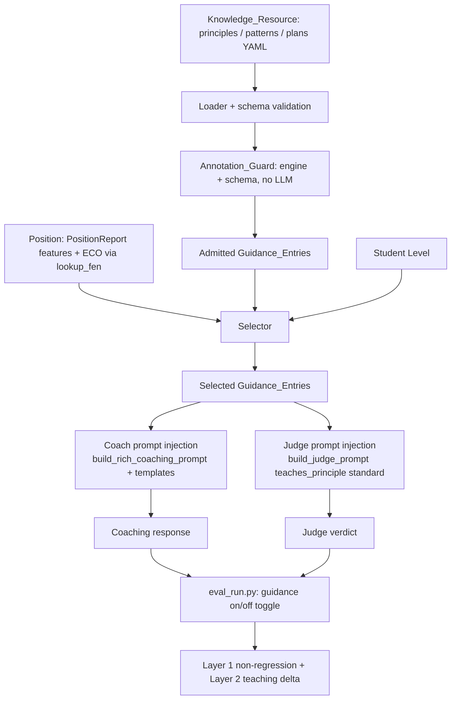

# Design Document: Pedagogy Layer

## Overview

The pedagogy layer supplies the **first end of the teaching bridge** — *what
to focus on* — from chess authority instead of the LLM's own chess sense. It
is a curated, local, version-controlled knowledge resource of principles,
patterns, and plans, plus a small, deterministic `Selector` that picks the
entries that fit a position, and two injection points that feed the same
selected guidance into **both** the coach prompt and the judge prompt.

Today the engine (Blunder's coaching protocol) grounds end 2 of the bridge —
*is this concrete action sound?* Nothing grounds end 1. The teaching voice
names principles from its own chess intuition, which is exactly what the
project will not blindly trust (VISION.md: "small models hallucinate; even
large ones misread boards"), and the eval harness's `teaches_principle`
criterion (`rubric.v2.yaml`) currently grades that half against the judge's
own chess knowledge rather than a real standard.

The design's central bet mirrors the coaching-eval harness: push everything
we can into **deterministic, offline, engine-grounded logic** and reserve the
LLM for the genuinely generative part (the coaching voice). The `Selector` is
a pure function of `(position features, knowledge resource, level, max)`. The
knowledge resource is data, authored and validated like the benchmark set.
The `Annotation_Guard` rejects ungrounded guidance using only the engine and
the schema — never an LLM. One `Selector` and one `Knowledge_Resource` are
the single source of guidance for the coach and the judge, so the standard
the judge grades against is exactly the standard the coach was given
(Requirement 4.5).



## Architecture

A new package `src/chess_coach/pedagogy/` holds the reusable library code
(loader, dataclasses, selector, guard, prompt-injection helpers), mirroring
how `src/chess_coach/eval/` is laid out. The curated data lives under
`data/pedagogy/`, mirroring `data/eval/`. The runnable guard entry point is a
script under `scripts/`, mirroring `scripts/eval_check_annotations.py`.

```
src/chess_coach/pedagogy/
    __init__.py
    resource.py       # Guidance_Entry dataclasses + fail-fast loader (mirrors benchmark.py)
    features.py        # PositionReport + ECO -> set[Position_Feature] extraction
    selector.py        # Selector: pure (features, resource, level, max) -> entries
    inject.py          # coach + judge prompt injection (the guidance block builders)
    guard.py           # Annotation_Guard checks (schema + features/ECO sets + example legality/soundness)
data/pedagogy/
    knowledge.yaml     # the curated resource (grows without code change)
    schema.md          # human-readable description of the defined feature/ECO/level sets
scripts/
    pedagogy_check.py  # runnable guard: validate knowledge.yaml vs engine + schema (no LLM)
```

### Integration points (existing code touched)

| Existing file | Change | Requirement |
|---|---|---|
| `src/chess_coach/prompts.py` | `build_rich_coaching_prompt` gains an optional `guidance` block; a new `format_guidance_block` helper renders selected entries; engine grounding text unchanged | 3.1–3.4 |
| `src/chess_coach/coaching_templates.py` | `generate_position_coaching*` accept selected guidance and surface it in a "what to focus on" section (template-only path) | 3.5 |
| `src/chess_coach/eval/judge.py` | `build_judge_prompt` gains the same `guidance` argument; injects it as the sole standard for `teaches_principle`; omits the criterion when guidance is empty | 4.1–4.6 |
| `scripts/eval_run.py` | `--guidance on/off` toggle; when on, build the selector once and pass identical selection to coach and judge; record the mode in `RunConfig` | 5.1–5.5 |
| `src/chess_coach/openings.py` | reused unchanged via `lookup_fen` for the ECO context of a position | 2.2 |

### Selection flow

1. Load `knowledge.yaml` into `GuidanceEntry` records; the loader fails fast
   on the first malformed entry (Requirement 1.8, 1.9).
2. The `Annotation_Guard` admits or rejects each entry using the schema and
   the engine — only admitted entries reach the `Selector` (Requirement 6.1).
3. For a position: extract its `Position_Feature` set from the
   `PositionReport` (and the ECO via `lookup_fen`), then `Selector.select`
   returns the entries whose features are all present, plus ECO-keyed plans,
   ordered by relevance and capped (Requirement 2).
4. The single selected list is handed to both the coach injection and the
   judge injection, so the two prompts carry identical guidance
   (Requirement 4.1, 4.5).

## Components and Interfaces

### Loader (`resource.py`)

Mirrors `benchmark.py`'s fail-fast loader exactly: read YAML, validate each
entry against the schema, raise a single typed error naming the offending
entry and field. No partial/best-effort loads.

```python
class PedagogyError(Exception):
    """Knowledge resource is malformed. Fail-fast: the message names the
    offending entry id and field so the author can fix it immediately."""

def load_resource(path: str | Path) -> KnowledgeResource: ...
def default_resource_path() -> Path: ...   # repo-relative data/pedagogy/knowledge.yaml
```

`KnowledgeResource` wraps the admitted entries and exposes lookups the
selector needs (`by_id`, `principles()`, `entries_for_feature`,
`plans_for_eco`) plus the defined sets (`feature_vocab`, `eco_vocab`,
`levels`) the guard validates against.

### Position features (`features.py`)

`Position_Feature`s are checkable characteristics keyed off the engine's
`PositionReport` (and ECO). The vocabulary is a closed, named set so both the
schema and the guard can validate references against it (Requirement 6.2).

```python
def extract_features(report: PositionReport) -> frozenset[str]: ...
def eco_context(fen: str) -> str | None:   # wraps openings.lookup_fen
```

Initial `Position_Feature` vocabulary (derived from `PositionReport` fields):

| Feature | Source in `PositionReport` |
|---|---|
| `phase:opening` / `phase:middlegame` / `phase:endgame` | move number / material on board |
| `undefended_piece` | `hanging_pieces` non-empty for side to move |
| `hanging_piece_opponent` | `hanging_pieces` non-empty for opponent |
| `threat_present` | `threats` non-empty |
| `tactic:fork` / `tactic:pin` / ... | `tactics[].type` |
| `passed_pawn` | `pawn_structure[side].passed` non-empty |
| `isolated_pawn` | `pawn_structure[side].isolated` non-empty |
| `exposed_king` | `king_safety[side].score` below a threshold |
| `open_file` | derived from board + pawn structure |

The vocabulary lives in one place (`features.py`) and is exported as
`FEATURE_VOCAB: frozenset[str]`; `data/pedagogy/schema.md` documents it for
authors. Adding a feature is a deliberate code change (a new checkable
extraction), unlike adding an entry, which is data-only (Requirement 1.1).

### Selector (`selector.py`)

A pure function — no I/O, no engine, no network — so it is cheap to test with
Hypothesis at hundreds of iterations and trivially satisfies the offline
requirements (Requirement 7.2, 7.4).

```python
@dataclass(frozen=True)
class SelectionInput:
    features: frozenset[str]
    eco: str | None
    level: str
    max_entries: int            # >= 1

def select(resource: KnowledgeResource, inp: SelectionInput) -> list[GuidanceEntry]:
    """Return the Guidance_Entries that fit this position, deterministically
    ordered and capped. See Correctness Properties 1-6."""
```

Selection algorithm:

1. **Feature match** — an entry matches when *every* `Position_Feature` it
   records is present in `inp.features` (Requirement 2.1). Entries with no
   recorded features never match here (plans match via ECO instead).
2. **ECO match** — every `Plan` whose recorded ECO codes include `inp.eco`
   is added (Requirement 2.2).
3. **Level filter** — drop entries whose recorded levels do not include
   `inp.level` (Requirement 3.3 is enforced at injection, but the selector
   also filters so the judge and coach see the same level-appropriate set).
4. **Fallback** — if steps 1–2 yield nothing, return the foundational
   `Principle` entries whose levels include `inp.level` (Requirement 2.5).
5. **Rank & cap** — order by a relevance key (number of matched features
   descending — more specific matches first — then `Plan` > `Pattern` >
   `Principle`), break ties by ascending `id` for a deterministic stable
   order, then truncate to `max_entries` (Requirement 2.3, 2.4).

Determinism falls out of using only the inputs and a total order on `id`
(Requirement 2.6). Referential integrity falls out of only ever returning
entries drawn from `resource` (Requirement 2.7). A malformed position is
rejected before feature extraction and surfaced as an error with an empty
result (Requirement 2.8).

### Coach prompt injection (`inject.py` + `prompts.py`)

`format_guidance_block(entries)` renders the selected entries into a compact
"What to focus on" block carrying **both ends of the bridge** for each entry:
its named theme and its how-to-apply statement (Requirement 3.2). The block
is inserted into `build_rich_coaching_prompt` *alongside* the existing engine
grounding instructions — the grounding text is never removed or weakened
(Requirement 3.4). When the selection is empty (or empty after level
filtering), the prompt is built exactly as today, with grounding intact and
no guidance block (Requirement 3.6, 3.7). The template-only path
(`coaching_templates.generate_position_coaching*`) receives the same entries
and renders them as a leading "focus" section (Requirement 3.5).

### Judge prompt injection (`inject.py` + `judge.py`)

`build_judge_prompt` gains a `guidance: list[GuidanceEntry]` argument. The
selected entries are rendered as the **sole standard** for the
`teaches_principle` criterion: the judge is told to grade that criterion only
against the provided guidance and not to use chess knowledge outside it
(Requirement 4.2, 4.3). When guidance is empty, the `teaches_principle`
criterion is dropped from the rubric for that position and the verdict records
that the criterion was *not graded* (a distinct state from pass/fail), so an
ungraded position never silently counts as a pass or a fail (Requirement
4.6). The harness builds one selection per position and passes the identical
list to both the coach call and the judge call (Requirement 4.1, 4.5).

### Annotation guard (`guard.py` + `scripts/pedagogy_check.py`)

Mirrors `eval/annotations.py` + `scripts/eval_check_annotations.py`. For each
entry the guard runs, in order, checks that use **only the schema and the
engine** (Requirement 6.7):

1. **Required fields** present and non-empty (Requirement 6.5).
2. **Referential integrity** — every referenced `Position_Feature` and
   `ECO_Code` is in the defined vocabulary (Requirement 6.2).
3. **Example legality** — where an entry carries a concrete example position
   (`example_fen` + `example_move`), the move is legal in that position via
   `python-chess` (Requirement 6.3).
4. **Engine soundness** — where an example exists, the engine's `compare`
   classifies the move as not losing / not a blunder (Requirement 6.4). This
   is the only engine-bound, higher-cost check.

A failing entry is rejected *individually*: the guard records its id and
reason, withholds it from the admitted set, and continues with the rest
(Requirement 6.6). Only admitted entries are visible to the `Selector`
(Requirement 6.1). The script exits non-zero when any entry is rejected, like
the benchmark guard.

### Eval integration (`scripts/eval_run.py`)

A `--guidance {on,off}` toggle (default `off` to preserve today's baseline).
When `on`, the runner loads the resource once, builds one `Selector` instance,
and for each position passes the identical selection to the coach prompt
build and (in Layer 2) to the judge prompt build. The mode is recorded in
`RunConfig`. Two runs over the *identical* benchmark set — one `off`, one
`on` — yield the Layer 1 non-regression check (Requirement 5.2) and the
Layer 2 teaching-quality delta (Requirement 5.4). Aggregation excludes any
response missing a Layer 1 or Layer 2 score and reports it, reusing the
coaching-eval scoring behavior (Requirement 5.5).

## Data Models

```python
@dataclass(frozen=True)
class ExamplePosition:
    """Optional concrete example anchoring a Guidance_Entry. When present,
    the guard checks legality (6.3) and engine-soundness (6.4)."""
    fen: str
    move: str            # UCI; the recommended action to teach

@dataclass(frozen=True)
class GuidanceEntry:
    id: str                          # unique within the resource (1.2, 1.9)
    type: str                        # "principle" | "pattern" | "plan" (1.2)
    theme: str                       # named theme, e.g. "center control" (1.2)
    focus: str                       # student-facing "what to focus on" (1.2)
    how_to_apply: str                # student-facing "how to apply it here" (1.2)
    levels: frozenset[str]           # subset of {beginner, intermediate, advanced} (1.4)
    features: frozenset[str]         # Position_Features; required for principle/pattern (1.6)
    eco_codes: frozenset[str]        # required for plan (1.5)
    citation: str                    # non-empty source authority (1.7)
    example: ExamplePosition | None  # optional (6.3, 6.4)

    def applies_to_level(self, level: str) -> bool:
        return level in self.levels

@dataclass(frozen=True)
class KnowledgeResource:
    entries: tuple[GuidanceEntry, ...]
    feature_vocab: frozenset[str]
    eco_vocab: frozenset[str]
    levels: frozenset[str]

    def by_id(self, entry_id: str) -> GuidanceEntry | None: ...
    def principles(self) -> tuple[GuidanceEntry, ...]: ...

@dataclass(frozen=True)
class GuardResult:
    """Outcome of validating one entry — mirrors the benchmark guard's
    mismatch-message style."""
    entry_id: str
    admitted: bool
    reasons: tuple[str, ...]         # empty iff admitted
```

The five foundational principles (Requirement 1.3) are authored entries in
`knowledge.yaml` with `type: principle` and themes `center control`,
`development`, `king safety`, `piece protection`, `piece coordination`; a unit
test asserts exactly these five exist.

Example `knowledge.yaml` shape (mirrors `positions.yaml` conventions):

```yaml
version: 1
entries:
  - id: principle.center_control
    type: principle
    theme: center control
    focus: >
      Control the central squares (e4, d4, e5, d5) — pieces in the center
      reach more of the board.
    how_to_apply: >
      Put a pawn or piece that fights for a central square, or trade off an
      enemy piece that defends one.
    levels: [beginner, intermediate, advanced]
    features: [phase:opening]
    citation: "Silman, How to Reassess Your Chess, ch. on the center"
  - id: pattern.back_rank
    type: pattern
    theme: back-rank weakness
    focus: A king hemmed in by its own pawns can be mated on the back rank.
    how_to_apply: >
      Look for a rook or queen that can reach the undefended back rank; or,
      defensively, make luft for your king.
    levels: [intermediate, advanced]
    features: [tactic:back_rank]
    citation: "Chernev, Logical Chess, back-rank examples"
    example:
      fen: "6k1/5ppp/8/8/8/8/5PPP/R5K1 w - - 0 1"
      move: a1a8
```

Existing models (`PositionReport`, `JudgeRubric`, `JudgeVerdict`,
`BenchmarkPosition`) are reused unchanged; `JudgeVerdict` gains the ability to
mark a criterion *not graded* (Requirement 4.6).

## Design Decisions and Rationale

- **Selector is a pure function, engine/network-free.** Selection keys off
  features already computed in the `PositionReport` and the local opening
  book. Keeping it pure makes the offline guarantees (7.2, 7.4) automatic and
  lets Hypothesis hammer the selection logic cheaply. The engine is only
  needed once, up front, to produce the report — exactly as in the eval
  harness.

- **One Selector + one Knowledge_Resource for coach and judge.** Requirement
  4.5 is structural, not behavioral: the harness constructs the selection
  once per position and hands the same list to both prompts. This guarantees
  the judge grades `teaches_principle` against the very guidance the coach
  was given — no second selection path that could drift.

- **Feature vocabulary is closed and code-defined; entries are data.** Adding
  a *new kind of checkable feature* is a real extraction change (code), but
  adding/removing/editing a *guidance entry* is data-only (Requirement 1.1).
  This matches the benchmark split (`KNOWN_KINDS` in code, positions in YAML)
  and lets the guard validate every entry's feature references against a
  defined set (Requirement 6.2).

- **Guard mirrors the benchmark annotation guard, and uses no LLM.** The
  lesson from coaching-eval is that hand-authored annotations drift from the
  oracle. The same risk applies to curated guidance, so the guard checks
  schema + engine soundness only (Requirement 6.7), rejects per-entry without
  aborting the batch (Requirement 6.6), and runs in CI on an engine-capable
  box like `eval_check_annotations.py`.

- **"Not graded" is a first-class verdict state.** When no guidance exists
  for a position, silently passing or failing `teaches_principle` would
  corrupt the aggregate. Recording *ungraded* (Requirement 4.6) and excluding
  it from the aggregate (Requirement 5.5) keeps the teaching-quality delta
  honest.

- **Guidance toggle defaults off.** The whole point of Requirement 5 is a
  controlled A/B over an identical scenario set. Defaulting `off` preserves
  the existing baseline; the delta is only meaningful when the two runs
  differ in exactly this one variable.

## Correctness Properties

*A property is a characteristic or behavior that should hold true across all
valid executions of a system — essentially, a formal statement about what the
system should do. Properties serve as the bridge between human-readable
specifications and machine-verifiable correctness guarantees.*

The pedagogy layer's core — the loader, the `Selector`, the prompt-injection
builders, the guard's schema checks, and the score aggregation — is
deterministic, pure logic over structured data, which is exactly where
property-based testing pays off. The engine-soundness check (6.4) and the
judge's grading *behavior* (4.3, 4.4) depend on the engine/LLM and are covered
by integration tests instead (see Testing Strategy).

### Property 1: Selection soundness and referential integrity

*For any* knowledge resource and any position feature set, every entry the
`Selector` returns is an entry that exists in the resource AND all of whose
recorded `Position_Features` are present in the position; and no resource
entry whose features are all present (and which survives level filtering and
the cap) is omitted.

**Validates: Requirements 2.1, 2.7**

### Property 2: ECO-keyed plan inclusion

*For any* resource and any known ECO context, every `Plan` entry whose
recorded ECO codes include that context is included in the selection (subject
to level filtering and the cap).

**Validates: Requirements 2.2**

### Property 3: Cap is always respected

*For any* resource, position, level, and configured maximum `n >= 1`, the
number of entries the `Selector` returns is at most `n`.

**Validates: Requirements 2.3**

### Property 4: Deterministic, stable ordering

*For any* fixed inputs (features, ECO, level, max), repeated `Selector`
invocations return the same entries in the same order, and that order is the
relevance ranking with ties broken by ascending `id`.

**Validates: Requirements 2.4, 2.6**

### Property 5: Level-appropriate fallback when nothing matches

*For any* position whose features and ECO match no entry, the `Selector`
returns exactly the foundational `Principle` entries whose recorded levels
include the student's level.

**Validates: Requirements 2.5**

### Property 6: Resource schema validation rejects malformed entries

*For any* entry that is missing a required field (id, type, theme, focus,
how-to-apply, levels, citation), records a type or level outside the defined
sets, omits features for a principle/pattern, omits ECO codes for a plan, or
shares an id with another entry, the loader rejects it (fail-fast) and the
error names the offending entry and the reason.

**Validates: Requirements 1.2, 1.4, 1.5, 1.6, 1.7, 1.8, 1.9**

### Property 7: Coach prompt carries both bridge ends and retains grounding

*For any* selected, level-appropriate guidance set, the coach prompt contains,
for every injected entry, both its named theme text and its how-to-apply text,
AND always contains the existing engine grounding instructions; when the set
is empty the prompt still contains the grounding instructions and no guidance
block.

**Validates: Requirements 3.1, 3.2, 3.4, 3.5, 3.6, 3.7**

### Property 8: Level filtering excludes inapplicable entries

*For any* selection and student level, no entry whose recorded levels exclude
that level appears in the injected coach prompt.

**Validates: Requirements 3.3**

### Property 9: Single-source parity between coach and judge

*For any* position, the guidance list handed to the coach prompt is identical
(same entries, same order) to the guidance list handed to the judge prompt,
produced by the one `Selector` over the one `Knowledge_Resource`.

**Validates: Requirements 4.1, 4.5**

### Property 10: Judge prompt grounds teaches_principle in the guidance

*For any* non-empty guidance set, the judge prompt contains each guidance
entry and the instruction to grade `teaches_principle` only against the
provided guidance; and *for any* empty guidance set, the `teaches_principle`
criterion is omitted from the prompt and the verdict records the criterion as
*not graded* (neither pass nor fail).

**Validates: Requirements 4.2, 4.6**

### Property 11: Guard gate, isolation, fields, and referential integrity

*For any* batch of entries, the guard admits or rejects each entry
independently — an entry with a missing/empty required field or a referenced
`Position_Feature` or `ECO_Code` absent from the defined sets is rejected with
its id and reason, while the remaining valid entries are still admitted — and
only admitted entries are ever visible to the `Selector`.

**Validates: Requirements 6.1, 6.2, 6.5, 6.6**

### Property 12: Guard verifies example move legality

*For any* entry carrying a concrete example position, the guard admits it only
if the recommended action is a legal move in that position, and rejects it
(with reason) otherwise.

**Validates: Requirements 6.3**

### Property 13: Offline, no-LLM operation

*For any* resource and position, the `Selector` and the guard's
schema/referential/legality checks complete successfully with no LLM provider
and no network configured, and produce results identical to operation with
connectivity available.

**Validates: Requirements 6.7, 7.2, 7.4**

### Property 14: Teaching-quality delta arithmetic and aggregate exclusion

*For any* pair of aggregate Layer 2 scores (guidance enabled and disabled)
over an identical scenario set, the reported difference equals the enabled
aggregate minus the disabled aggregate; and *for any* set of evaluated
responses, any response missing a Layer 1 or Layer 2 score is excluded from
the aggregates and reported with an identifying indication.

**Validates: Requirements 5.4, 5.5**

## Error Handling

| Failure | Detection | Recovery |
|---|---|---|
| `knowledge.yaml` missing or corrupt | load-time validation | Fail fast with a clear "Knowledge_Resource unavailable" error; **no** external retrieval attempted; any previously loaded resource state is left unchanged (Requirement 7.5) |
| Entry missing field / bad type / bad level / dup id | loader schema validation | Fail fast naming the offending entry and field (Requirement 1.8, 1.9) |
| Entry references unknown feature/ECO, empty field, illegal example move | `Annotation_Guard` | Reject that entry with id + reason; continue with the rest; withhold from `Selector` (Requirement 6.6) |
| Example move engine-classified as losing/blunder | `Annotation_Guard` + engine | Reject that entry with id + reason (Requirement 6.4) |
| Malformed / invalid position presented to `Selector` | feature extraction guard | Return no entries and signal an error indication (Requirement 2.8) |
| Selector finds no match | selection logic | Fall back to level-appropriate foundational principles (Requirement 2.5) — not an error |
| No guidance for a position at judge time | injection | Omit `teaches_principle`; record it ungraded; exclude from the aggregate (Requirement 4.6, 5.5) |
| Engine unavailable when running the guard | `CoachingEngine.start` fails | Abort the guard run with a clear message (cannot verify soundness), like `eval_check_annotations.py` |

The guard never aborts the whole batch for one bad entry, and a resource
load failure never mutates previously loaded state — both are explicit
fail-isolated behaviors, not best-effort guesses.

## Testing Strategy

**Dual approach.** Property-based tests (Hypothesis, **≥100 iterations**)
cover the deterministic core; example-based unit tests cover specific
scenarios and edge cases; integration tests with the real engine and a mock
judge cover the engine/LLM-bound parts that PBT cannot.

Because the `Selector`, loader, injection builders, guard schema checks, and
score aggregation are pure functions over structured data, they are ideal PBT
targets. The engine-soundness guard check (6.4) and the judge's grading
*behavior* (4.3, 4.4) are **not** PBT targets — they depend on the engine/LLM
and use integration tests with 1–3 representative examples.

### Property tests (Hypothesis, ≥100 iterations each)

Each test is tagged with a comment referencing its design property:
**Feature: pedagogy-layer, Property {n}: {property text}**. A Hypothesis
strategy generates `GuidanceEntry` records, `KnowledgeResource`s, feature
sets, levels, and caps.

| Property | Test | Strategy |
|---|---|---|
| P1 selection soundness + referential integrity | `test_select_matches_exactly_feature_subset` | random resource + feature set; compare against a brute-force reference selection |
| P2 ECO plan inclusion | `test_select_includes_eco_plans` | random plans with eco_codes + a chosen eco |
| P3 cap respected | `test_select_respects_max` | many matching entries + small max |
| P4 deterministic stable order | `test_select_deterministic_and_stable` | call twice; assert identical; assert id tie-break |
| P5 fallback | `test_select_fallback_principles` | feature sets matching nothing |
| P6 schema validation | `test_loader_rejects_malformed_entry` | entries with each field dropped / out-of-set value / duplicate id |
| P7 coach injection + grounding | `test_coach_prompt_carries_bridge_and_grounding` | random selected sets incl. empty |
| P8 level filtering | `test_coach_prompt_excludes_wrong_level` | mixed-level entries |
| P9 coach/judge parity | `test_coach_judge_selection_parity` | random positions; compare the two lists |
| P10 judge teaches_principle grounding | `test_judge_prompt_grounds_or_omits` | non-empty and empty guidance sets |
| P11 guard gate/isolation/fields/refs | `test_guard_isolates_and_validates` | batches mixing valid + invalid entries |
| P12 guard example legality | `test_guard_rejects_illegal_example` | entries with legal/illegal example moves |
| P13 offline / no-LLM | `test_selector_and_guard_offline` | run with no provider/network |
| P14 delta + aggregate exclusion | `test_delta_and_exclusion` | pairs of aggregates; response sets with unscored entries |

The PBT library is the repo's existing **Hypothesis** dependency — no
property-testing framework is written from scratch.

### Unit tests (specific examples and edge cases)

- The five foundational principles exist exactly (Requirement 1.3).
- Loader on a sample `knowledge.yaml` (happy path round-trip).
- Malformed position → empty result + error indication (Requirement 2.8).
- Resource load failure leaves a previously loaded resource unchanged and
  performs no external fetch (Requirement 7.5).
- Judge verdict marks `teaches_principle` ungraded when guidance is empty
  (Requirement 4.6), and the harness surfaces the pass/fail when graded
  (Requirement 5.3).
- Selection completes well within the 5-second bound (Requirement 7.3) — a
  trivial timing smoke check, since selection is pure.

### Integration tests (engine / LLM bound)

- `scripts/pedagogy_check.py` against the real engine over the curated
  `knowledge.yaml`: every example entry's move is legal and engine-sound
  (Requirement 6.3, 6.4), and the guard uses **no** LLM (Requirement 6.7).
- `scripts/eval_run.py --guidance on` vs `--guidance off` over the identical
  benchmark set with a **mock judge** (canned verdicts): verifies the pipeline
  produces both Layer 1 and Layer 2 scores (Requirement 5.1), reports the
  `teaches_principle` result (Requirement 5.3), and emits the enabled
  aggregate, disabled aggregate, and their difference (Requirement 5.4). The
  Layer 1 non-regression (5.2) and the teaching-quality delta are *measured
  outcomes* of this A/B run, reported by the harness rather than asserted as
  unit invariants.

### Conventions

- Python 3.11, `src/` layout, `uv`-managed, `mypy --strict` clean, `ruff`.
- No new runtime external dependencies; everything offline/local.
- Property tests configured to a minimum of 100 iterations.
