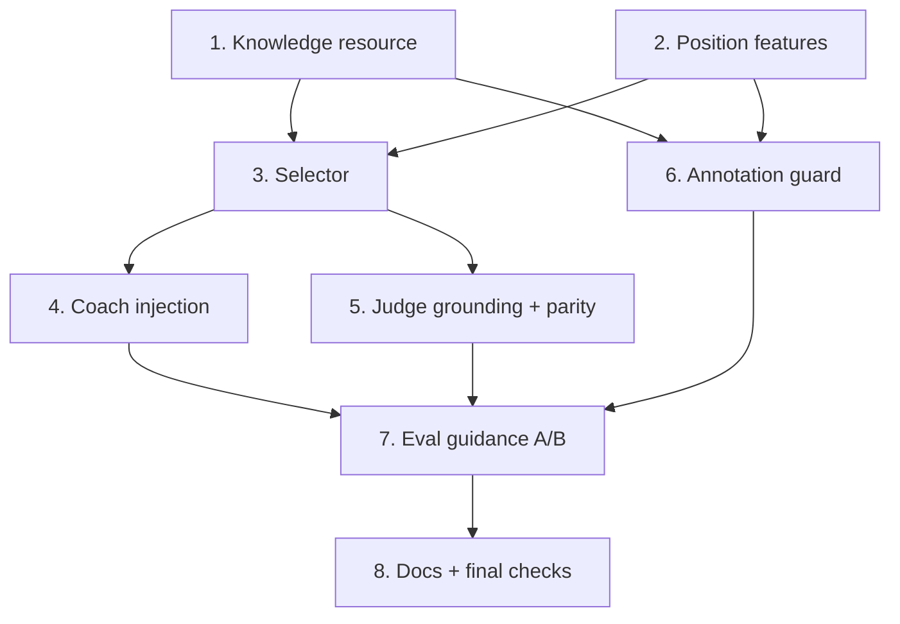

# Implementation Plan

## Overview

Build the pedagogy layer bottom-up so the project stays green at every
step and the offline, no-LLM core lands before the prompt/judge wiring:
the knowledge resource and position-feature extraction first, then the
pure `Selector`, then the coach and judge injection points that consume
it, then the annotation guard, and finally the eval `--guidance` A/B
toggle. Property-based tests (Hypothesis, ≥100 iterations) and unit
tests are woven into each task group, not deferred. Engine-soundness
(Req 6.4) and judge grading behavior (Req 4.3/4.4) are integration /
mock-judge tests per the design, not property tests.

Conventions: Python 3.11, `src/` layout, `uv run pytest` / `uv run mypy
src` (strict) / `uv run ruff check src tests` + `ruff format --check`,
offline/local, no new runtime dependencies. Property tests are tagged
`Feature: pedagogy-layer, Property {n}: ...`.

## Tasks

- [ ] 1. Knowledge resource: data model, loader, and curated seed
  - [ ] 1.1 Create `src/chess_coach/pedagogy/__init__.py` and
        `src/chess_coach/pedagogy/resource.py` with frozen dataclasses
        `ExamplePosition`, `GuidanceEntry`, `KnowledgeResource`, and a
        `PedagogyError`, mirroring `eval/benchmark.py`.
  - [ ] 1.2 Implement `load_resource(path)` + `default_resource_path()`
        reading `data/pedagogy/knowledge.yaml` with fail-fast schema
        validation: required non-empty fields; `type` in
        {principle,pattern,plan}; `levels` ⊆ {beginner,intermediate,
        advanced}; principle/pattern require `features`; plan requires
        `eco_codes`; reject duplicate ids — error names the offending
        entry and field.
  - [ ] 1.3 Author `data/pedagogy/knowledge.yaml` seed including exactly
        the five foundational Principles (center control, development,
        king safety, piece protection, piece coordination) plus a few
        patterns/plans with citations; add `data/pedagogy/schema.md`
        documenting the defined feature/ECO/level sets for authors.
  - [ ] 1.4 Property test (Property 6): generated entries with each
        required field dropped / out-of-set type or level / missing
        features-or-eco / duplicate id are rejected with a clear reason;
        unit test: happy-path round-trip of the seed; unit test: the
        five foundational principles exist exactly.
  - _Requirements: 1.1, 1.2, 1.3, 1.4, 1.5, 1.6, 1.7, 1.8, 1.9_

- [ ] 2. Position-feature extraction and ECO context
  - [ ] 2.1 Create `src/chess_coach/pedagogy/features.py` with a closed,
        exported `FEATURE_VOCAB: frozenset[str]` and
        `extract_features(report: PositionReport) -> frozenset[str]`
        covering the engine-provided features (phase, undefended/hanging
        pieces, threats, tactics:<type>, passed/isolated pawns,
        king-safety) read directly from `PositionReport`.
  - [ ] 2.2 Add the two derived detections the engine does not hand us
        directly — `open_file` and `exposed_king` (threshold-based) —
        with their own focused unit tests.
  - [ ] 2.3 Add `eco_context(fen) -> str | None` wrapping
        `openings.lookup_fen`.
  - [ ] 2.4 Unit tests: representative `PositionReport`s map to the
        expected feature sets; every emitted feature is a member of
        `FEATURE_VOCAB`.
  - _Requirements: 2.1, 2.2, 6.2_

- [ ] 3. Selector (pure selection logic)
  - [ ] 3.1 Create `src/chess_coach/pedagogy/selector.py` with frozen
        `SelectionInput(features, eco, level, max_entries>=1)` and
        `select(resource, inp) -> list[GuidanceEntry]` implementing:
        feature-subset match, ECO-keyed plan inclusion, level filter,
        fallback to level-appropriate foundational principles, relevance
        rank (matched-feature count desc, then plan>pattern>principle)
        with ascending-id tie-break, then cap.
  - [ ] 3.2 Return no entries plus an error indication for a malformed
        position (guarded before feature extraction).
  - [ ] 3.3 Property tests: Property 1 (soundness + referential
        integrity, vs a brute-force reference), Property 2 (ECO plan
        inclusion), Property 3 (cap respected), Property 4 (deterministic
        + stable id tie-break), Property 5 (level-appropriate fallback).
  - _Requirements: 2.1, 2.2, 2.3, 2.4, 2.5, 2.6, 2.7, 2.8_

- [ ] 4. Coach prompt injection
  - [ ] 4.1 Create `src/chess_coach/pedagogy/inject.py` with
        `format_guidance_block(entries)` rendering, per entry, both its
        named theme and its how-to-apply text ("what to focus on" block).
  - [ ] 4.2 Add an optional `guidance` argument to
        `build_rich_coaching_prompt` in `prompts.py`: inject the block
        while leaving the existing engine-grounding instructions intact;
        empty/empty-after-filter selection ⇒ prompt built as today with
        grounding and no guidance block.
  - [ ] 4.3 Feed the same selected entries to the template-only path
        (`coaching_templates.generate_position_coaching*`) as a leading
        focus section.
  - [ ] 4.4 Property tests: Property 7 (both bridge ends present +
        grounding always retained, incl. empty case), Property 8 (level
        filtering excludes inapplicable entries).
  - _Requirements: 3.1, 3.2, 3.3, 3.4, 3.5, 3.6, 3.7_

- [ ] 5. Judge grounding and coach/judge parity
  - [ ] 5.1 Add a `guidance: list[GuidanceEntry]` argument to
        `build_judge_prompt` in `eval/judge.py`: render it as the sole
        standard for `teaches_principle` and instruct the judge to grade
        that criterion only against the provided guidance.
  - [ ] 5.2 Add a "not graded" verdict state so that when guidance is
        empty the `teaches_principle` criterion is omitted and recorded
        as not-graded (never silently pass/fail); keep `parse_verdict`
        and scoring consistent with the new state.
  - [ ] 5.3 Ensure one `Selector` + one `KnowledgeResource` produce a
        single selection per position handed identically to coach and
        judge (single-source parity).
  - [ ] 5.4 Property tests: Property 9 (coach/judge selection parity —
        same entries, same order), Property 10 (non-empty ⇒ grounded in
        prompt; empty ⇒ omitted + not-graded). Unit test: graded
        pass/fail surfaces normally.
  - _Requirements: 4.1, 4.2, 4.5, 4.6_

- [ ] 6. Annotation guard
  - [ ] 6.1 Create `src/chess_coach/pedagogy/guard.py` with a
        `GuardResult` and per-entry validation: required-field presence,
        feature/ECO referential integrity against the defined sets, and
        (where an example is present) move legality via `python-chess`.
        Reject per-entry with id + reason; continue the batch; only
        admitted entries reach the `Selector`.
  - [ ] 6.2 Add the engine-soundness check: where an entry has an
        example, the engine's compare classifies the move as not
        losing / not a blunder (the only engine-bound check). No LLM.
  - [ ] 6.3 Create `scripts/pedagogy_check.py` mirroring
        `scripts/eval_check_annotations.py`: validate
        `knowledge.yaml` against schema + engine, per-entry PASS/REJECT
        report, exit non-zero on any rejection; abort clearly if the
        engine is unavailable.
  - [ ] 6.4 Property tests: Property 11 (gate/isolation/fields/refs),
        Property 12 (example move legality), Property 13 (selector +
        schema/ref/legality checks run with no LLM/network). Integration
        test (engine): example entries in the seed are legal +
        engine-sound (Req 6.4).
  - _Requirements: 6.1, 6.2, 6.3, 6.4, 6.5, 6.6, 6.7, 7.2, 7.4_

- [ ] 7. Eval integration: guidance A/B toggle
  - [ ] 7.1 Add `--guidance {on,off}` (default off) to
        `scripts/eval_run.py`: when on, load the resource + build one
        `Selector`, and for each position pass the identical selection
        to the coach prompt and (Layer 2) the judge prompt; record the
        mode in `RunConfig`.
  - [ ] 7.2 Report the enabled aggregate, disabled aggregate, and their
        numeric difference for Layer 2 teaching quality; exclude any
        response missing a Layer 1 or Layer 2 score from the aggregates
        and report it.
  - [ ] 7.3 Property test: Property 14 (delta arithmetic + aggregate
        exclusion). Integration test with a mock judge over an identical
        scenario set: pipeline produces Layer 1 + Layer 2 scores, reports
        the `teaches_principle` result, and emits enabled/disabled/delta.
  - [ ] 7.4 Resource-load-failure path: missing/corrupt `knowledge.yaml`
        ⇒ clear "Knowledge_Resource unavailable" error, no external
        fetch, prior state unchanged (Req 7.5); offline selection within
        the 5s bound (Req 7.3) as a timing smoke check.
  - _Requirements: 5.1, 5.2, 5.3, 5.4, 5.5, 7.1, 7.3, 7.5_

- [ ] 8. Documentation and final checks
  - [ ] 8.1 Document the pedagogy layer in `docs/` (what the knowledge
        resource is, how to author an entry, how to run
        `pedagogy_check.py`, and the `eval_run.py --guidance` A/B), and
        cross-link `VISION.md` / `docs/evaluation.md`.
  - [ ] 8.2 Full green check: `uv run pytest`, `uv run mypy src`,
        `uv run ruff check src tests`, `uv run ruff format --check src
        tests`; update `BACKLOG.md` (mark the pedagogy-layer item in
        progress / done and note any deferrals).
  - _Requirements: all (validation)_

## Task Dependency Graph



- Task 1 and Task 2 are independent and can proceed in parallel.
- Task 3 depends on both 1 and 2.
- Tasks 4 and 5 depend on 3 and can proceed in parallel.
- Task 6 depends on 1 and 2 and can run in parallel with 3/4/5.
- Task 7 depends on 4, 5, and 6.
- Task 8 is last.

```json
{
  "waves": [
    { "wave": 1, "tasks": ["1", "2"] },
    { "wave": 2, "tasks": ["3", "6"] },
    { "wave": 3, "tasks": ["4", "5"] },
    { "wave": 4, "tasks": ["7"] },
    { "wave": 5, "tasks": ["8"] }
  ]
}
```

## Notes

- The `Selector`, loader, injection builders, and guard schema checks
  are pure functions over structured data — the primary property-test
  surface (Hypothesis ≥100 iterations).
- Engine-soundness (Req 6.4) and judge grading behavior (Req 4.3/4.4)
  are engine/LLM-bound and covered by integration / mock-judge tests,
  not property tests.
- `--guidance` defaults off so the eval A/B isolates exactly one
  variable; the Layer 1 non-regression (Req 5.2) is a measured outcome
  of the off-vs-on run, reported by the harness.
- The feature vocabulary (`FEATURE_VOCAB`) is code-defined and closed;
  guidance entries are data-only and grow without code change.
